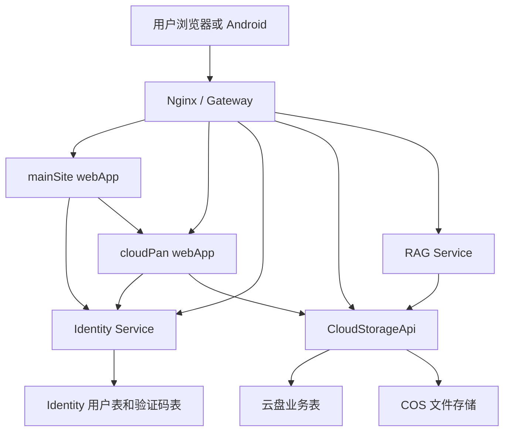

# Alicia 统一身份服务整改方案

本文档用于拆分现有云盘账号体系，把“用户身份”抽成可被主站、云盘和后续工具共同使用的独立 Identity Service。目标是稳定、高效、安全、干净地演进，不做只靠路由转发或复制用户表的临时方案。

## 1. 目标

当前 `CloudStorageApi` 同时承担了登录注册、用户资料、管理员账号管理、云盘额度、头像和主页背景等职责。后续主站也需要登录，新工具模块也会继续增加，因此需要把公共身份能力抽出。

最终目标：

- 主站、云盘、后续工具共享同一套用户身份。
- 用户表只由 Identity Service 写入和维护。
- 云盘只保存云盘业务资料，例如容量、主页背景、文件、分享、传输等。
- 前端和移动端优先保持接口兼容，逐步迁移，不一次性推翻现有能力。
- 生产部署能分阶段上线，每一步都有验证和回滚方式。

## 2. 核心原则

1. 公共的是身份，不是让所有业务服务直接读写同一张用户表。
2. Identity Service 是用户表、密码、邮箱验证码、登录令牌、刷新令牌、账号状态的唯一所有者。
3. CloudStorageApi 只消费身份结果，不能再直接修改密码、验证码、邮箱、账号状态。
4. 业务数据继续归业务服务所有。云盘的 `storage_node`、`share_link`、`multipart_upload_session` 等仍归云盘服务。
5. 第一期迁移优先保留现有用户 ID，避免文件归属和分享归属大规模重写。
6. 对外接口尽量兼容现有 `/api/auth/**`、`/api/storage/**`、`/api/share-links/**`，降低 Web 和 Android 的改造风险。

## 3. 当前结构复核

### 3.1 后端认证入口

当前认证接口集中在：

- `CloudStorageApi/src/main/java/com/alicia/cloudstorage/api/controller/AuthController.java`

现有职责：

- `POST /api/auth/login`
- `POST /api/auth/register/email-code`
- `POST /api/auth/register/verify`
- `GET /api/auth/me`
- `PUT /api/auth/profile`
- `POST /api/auth/avatar`
- `GET /api/auth/avatar/{userId}`
- `PUT /api/auth/password`

云盘个性化资料入口已迁出：

- `POST /api/cloud-profile/background`
- `GET /api/cloud-profile/background/{userId}`
- `DELETE /api/cloud-profile/background`

问题：

- 登录注册属于公共身份。
- `me`、昵称、头像、密码属于公共身份或账号中心。
- 主页背景属于云盘个性化设置，已从 `AuthController` 移到 `CloudProfileController`。
- `AuthController` 后续继续收敛为登录、注册、公共资料、头像和密码相关入口。

### 3.2 后端账号业务

当前主要服务：

- `CloudStorageApi/src/main/java/com/alicia/cloudstorage/api/service/UserAccountService.java`
- `CloudStorageApi/src/main/java/com/alicia/cloudstorage/api/service/EmailRegistrationService.java`
- `CloudStorageApi/src/main/java/com/alicia/cloudstorage/api/auth/TokenService.java`
- `CloudStorageApi/src/main/java/com/alicia/cloudstorage/api/auth/AuthService.java`

现有混合职责：

- 邮箱和手机号登录。
- 邮箱验证码注册。
- 密码哈希和密码修改。
- Token 生成和校验。
- 用户角色、账号状态校验。
- 用户昵称、头像。
- 云盘容量额度。
- 云盘主页背景。
- 管理员创建用户、重置密码、调整用户容量。

问题：

- `UserAccountService` 同时依赖 `SysUserRepository`、`TokenService`、`CosFileStorageService`、`StorageQuotaService`，公共身份和云盘业务耦合。
- `AuthService` 校验 token 后还会查询 `sys_user`，导致所有业务服务都依赖本地用户表。
- `TokenService` 是自定义 HMAC token，不利于多服务本地校验和后续标准化。

### 3.3 管理员用户管理

当前入口：

- `CloudStorageApi/src/main/java/com/alicia/cloudstorage/api/controller/AdminIdentityUserController.java`
- `CloudStorageApi/src/main/java/com/alicia/cloudstorage/api/controller/AdminCloudUserProfileController.java`

现有职责：

- `GET /api/admin/users`
- `POST /api/admin/users`
- `PUT /api/admin/users/{userId}/password`
- `PUT /api/admin/cloud-users/{userId}/quota`

问题：

- 创建用户、重置密码是 Identity 管理职责。
- 调整容量是云盘业务职责。
- 一个用户管理面板现在把身份管理和云盘额度管理混在一起。

### 3.4 数据表

当前核心用户表：

- `sys_user`

当前字段来源：

- 初始表：`CloudStorageApi/src/main/resources/db/migration/V1__init_schema.sql`
- 容量字段：`V5__add_user_storage_quota.sql`
- 主页背景字段：`V6__add_user_home_background.sql`
- token 版本字段：`V7__add_user_token_version.sql`
- 邮箱注册字段：`V11__add_email_registration.sql`

当前 `sys_user` 字段归属判断：

| 字段 | 当前含义 | 目标归属 |
| --- | --- | --- |
| `id` | 用户主键 | Identity，保留为全局用户 ID |
| `phone_number` | 手机号登录标识 | Identity |
| `email` | 邮箱登录标识 | Identity |
| `email_verified_at` | 邮箱验证时间 | Identity |
| `nickname` | 公共昵称 | Identity |
| `avatar_url` | 公共头像 | Identity |
| `password_hash` | 密码哈希 | Identity |
| `token_version` | 登录态失效版本 | Identity |
| `role` | 当前全局角色 | Identity 第一期保留，后续可拆服务角色 |
| `status` | 账号状态 | Identity |
| `storage_quota_bytes` | 云盘容量 | CloudStorageApi |
| `home_background_url` | 云盘主页背景 | CloudStorageApi |
| `created_at` | 创建时间 | Identity |
| `updated_at` | 更新时间 | Identity |

当前验证码表：

- `email_verification_code`

目标归属：

- Identity。

当前云盘业务表引用：

- `storage_node.owner_id`
- `multipart_upload_session.owner_id`
- `share_link.owner_id`

目标语义：

- 这些字段继续表示文件、上传会话、分享的拥有者。
- 第一期不强制改列名，避免大规模迁移。
- 代码层逐步把概念从 `ownerId` 明确为 `identityUserId`。

## 4. 目标结构

### 4.1 服务结构

建议最终结构：

```text
mainSite
  webApp
    主站首页
    统一登录入口
    工具入口导航

AliciaCloudStorage
  identityApi
    用户注册
    用户登录
    邮箱验证码
    密码与登录态
    账号资料
    账号状态
    管理员身份管理

  CloudStorageApi
    文件节点
    上传下载
    分享链接
    回收站
    云盘容量
    云盘主页背景
    云盘管理员业务配置

  rag
    AI 语义服务
    继续通过 CloudStorageApi 执行业务操作

  webApp
    云盘前端
    使用 Identity 登录态

  phoneAppAdd
    Android 客户端
    使用 Identity 登录态
```

### 4.2 请求路径结构

在“不额外申请子域名证书”的方案下，推荐路径：

```text
https://windwindwind-alicia.cn/
  主站

https://windwindwind-alicia.cn/login
  统一登录入口

https://windwindwind-alicia.cn/cloudPan/
  云盘 Web

https://windwindwind-alicia.cn/api/auth/**
  Identity Service

https://windwindwind-alicia.cn/api/admin/identity/**
  Identity 管理接口

https://windwindwind-alicia.cn/api/storage/**
  CloudStorageApi

https://windwindwind-alicia.cn/api/share-links/**
  CloudStorageApi

https://windwindwind-alicia.cn/api/public/share-links/**
  CloudStorageApi

https://windwindwind-alicia.cn/rag/**
  RAG Service
```

这样可以保留一个 HTTPS 证书，同时把主站和云盘从页面层分开。

### 4.3 逻辑关系



## 5. Identity Service 边界

### 5.1 Identity 拥有的能力

Identity Service 负责：

- 邮箱注册验证码发送和校验。
- 手机号或邮箱登录。
- 密码哈希、密码修改、管理员重置密码。
- Token 签发、刷新、注销、失效。
- 当前用户资料读取。
- 用户昵称、头像、邮箱、手机号。
- 账号状态：启用、停用。
- 全局角色：至少保留 `ADMIN`、`USER`。
- 管理员账号创建。

Identity Service 不负责：

- 云盘容量。
- 云盘主页背景。
- 文件、目录、分享、回收站。
- RAG 对文件的语义操作。
- 工具模块自己的业务权限细节。

### 5.2 CloudStorageApi 保留的能力

CloudStorageApi 负责：

- 文件和目录业务。
- 分享链接业务。
- 文件下载、预览、访问 URL。
- 上传任务和分片上传。
- 回收站。
- 云盘使用量统计。
- 云盘容量额度。
- 云盘主页背景。
- 云盘用户业务画像，例如是否初始化过云盘空间。

CloudStorageApi 不再负责：

- 注册登录。
- 邮箱验证码。
- 密码哈希。
- token 签发。
- 用户账号停用和密码重置。

### 5.3 主站能力

mainSite 负责：

- 工具集首页。
- 统一登录页或登录入口。
- 登录后展示用户信息和工具入口。
- 跳转云盘和后续工具。

mainSite 不直接写用户表。

## 6. 数据模型整改

### 6.1 第一期推荐表结构

为了降低迁移风险，第一期可以保留当前 `sys_user` 表名，由 Identity Service 接管它。这样已有 `owner_id` 引用不需要立刻改动。

Identity Service 拥有：

```text
sys_user
email_verification_code
identity_refresh_token
identity_audit_log
```

CloudStorageApi 新增：

```text
cloud_user_profile
```

建议 `cloud_user_profile` 字段：

| 字段 | 说明 |
| --- | --- |
| `identity_user_id` | 对应 `sys_user.id`，主键 |
| `storage_quota_bytes` | 云盘容量 |
| `home_background_url` | 云盘主页背景 |
| `created_at` | 创建时间 |
| `updated_at` | 更新时间 |

第一期数据迁移：

```text
cloud_user_profile.identity_user_id = sys_user.id
cloud_user_profile.storage_quota_bytes = sys_user.storage_quota_bytes
cloud_user_profile.home_background_url = sys_user.home_background_url
```

第一期暂时不删除 `sys_user.storage_quota_bytes` 和 `sys_user.home_background_url`，只停止新代码写入。等生产稳定后再做清理迁移。

当前已落地：

- `V12__create_cloud_user_profile.sql` 创建 `cloud_user_profile`。
- 首次迁移时从 `sys_user.storage_quota_bytes` 和 `sys_user.home_background_url` 回填老用户云盘资料。
- `CloudUserProfileService` 通过 `CloudUserProfileRepository` 读写云盘额度和主页背景。
- `StorageQuotaService` 通过云盘资料读取器从 `cloud_user_profile` 获取容量。
- 旧 `sys_user` 字段暂时保留，只作为缺失 profile 时的兼容兜底。

### 6.2 第二期表结构清理

生产稳定后再考虑：

- `sys_user` 重命名为 `identity_user`。
- 删除 `sys_user.storage_quota_bytes`。
- 删除 `sys_user.home_background_url`。
- 业务表外键从数据库强 FK 改为逻辑约束，或者继续保留同库 FK。选择取决于后续是否要把 Identity 单独数据库化。

### 6.3 不建议的做法

不建议：

- 主站、云盘、未来工具都直接连 MySQL 写 `sys_user`。
- 复制一份用户表到主站。
- 让 CloudStorageApi 调 Identity 数据库，而不是调用 Identity API 或校验 Identity token。
- 一次性重命名所有 `owner_id` 列，风险高且收益不大。

## 7. Token 与鉴权整改

### 7.1 当前问题

当前 token 由 `TokenService` 自定义生成，payload 中包含：

```text
userId:phoneNumber:tokenVersion:expiresAt
```

问题：

- 多服务验证不方便。
- payload 依赖手机号字段，不适合邮箱和多登录标识。
- CloudStorageApi 校验 token 后还需要查本地 `sys_user`。

### 7.2 目标方案

Identity Service 签发标准 JWT：

```text
iss: https://windwindwind-alicia.cn
sub: 用户 ID
aud: alicia-tools
role: ADMIN / USER
status: ACTIVE
ver: token version
iat: 签发时间
exp: 过期时间
```

推荐：

- 第一期可以继续使用对称签名，降低改造成本。
- 中期切换到非对称签名和 JWKS，让 CloudStorageApi、RAG 或后续服务只持有公钥。
- 保留 token version，用于密码修改和管理员重置密码后的登录态失效。

### 7.3 CloudStorageApi 鉴权改造

替换当前：

- `AuthService`
- `TokenService`
- `AuthInterceptor`
- `AdminAuthInterceptor`

目标：

- `AuthInterceptor` 从 JWT 中解析 `CurrentPrincipal`。
- `CurrentPrincipal` 至少包含：`userId`、`role`、`status`、`tokenVersion`、`expiresAt`。
- 普通业务接口只接收 `userId`。
- 管理接口校验 `role`。
- 需要强一致账号状态时，通过 Identity 内部接口或短缓存 introspection 校验。

## 8. 接口整改清单

### 8.1 Identity 对外接口

第一期建议保持现有路径，减少前端和 Android 改动：

| 方法 | 路径 | 归属 |
| --- | --- | --- |
| `POST` | `/api/auth/login` | Identity |
| `POST` | `/api/auth/register/email-code` | Identity |
| `POST` | `/api/auth/register/verify` | Identity |
| `GET` | `/api/auth/me` | Identity |
| `PUT` | `/api/auth/profile` | Identity |
| `POST` | `/api/auth/avatar` | Identity |
| `GET` | `/api/auth/avatar/{userId}` | Identity |
| `PUT` | `/api/auth/password` | Identity |

新增建议：

| 方法 | 路径 | 说明 |
| --- | --- | --- |
| `POST` | `/api/auth/token/refresh` | 刷新登录态 |
| `POST` | `/api/auth/logout` | 注销当前登录态 |
| `GET` | `/api/auth/jwks` | 公钥发布，第二期启用 |

### 8.2 CloudStorageApi 对外接口

保留：

- `/api/storage/**`
- `/api/share-links/**`
- `/api/public/share-links/**`
- `/api/app-package/**`
- `/api/admin/app-package/**`

已迁移：

| 当前接口 | 调整 |
| --- | --- |
| `/api/auth/background` | 移到 `/api/cloud-profile/background` |
| `/api/auth/background/{userId}` | 移到 `/api/cloud-profile/background/{userId}` |
| `/api/admin/users/{userId}/quota` | 移到 `/api/admin/cloud-users/{userId}/quota` |

兼容策略：

- 当前应用尚未正式发布，旧 `/api/auth/background` 路径不再保留。
- 当前应用尚未正式发布，旧 `/api/admin/users/{userId}/quota` 路径不再保留。
- Web 已直接调用 `/api/cloud-profile/background`。
- Web 和 Android 已直接调用 `/api/admin/cloud-users/{userId}/quota`。
- Android 当前只读取 `homeBackgroundUrl` 响应字段，未发现上传/清空背景接口调用。

### 8.3 管理端拆分

Identity 管理：

- 创建用户。
- 停用用户。
- 重置密码。
- 修改全局角色。
- 查看用户基础资料。

Cloud 管理：

- 调整云盘容量。
- 查看云盘用量。
- 查看云盘用户初始化状态。

前端可以继续一个“用户管理”面板，但数据来源拆成两块：

- Identity 用户列表。
- Cloud 用户容量和使用量。

## 9. 前端整改位置

### 9.1 云盘 Web

当前相关位置：

- `webApp/src/lib/api.ts`
- `webApp/src/lib/session.ts`
- `webApp/src/lib/unifiedLogin.ts`
- `webApp/src/context/session-context.tsx`
- `webApp/src/components/protected-route.tsx`
- `webApp/src/pages/UnifiedLoginRedirectPage.tsx`
- `webApp/src/pages/DrivePage.tsx`
- `webApp/src/features/drive/hooks/useDriveProfileSettings.ts`
- `webApp/src/features/drive/hooks/useDriveAccountsAdmin.ts`
- `webApp/src/components/UserManagementPanel.tsx`
- `webApp/src/features/drive/DriveProfileModals.tsx`

改造方向：

1. 登录和注册由 mainSite `/login` 承载，云盘 Web 不再拥有独立登录页面。
2. 云盘未登录或 token 过期时跳转 `/login?returnTo=/cloudPan/`。
3. `User` 类型拆成：
   - `IdentityUser`
   - `CloudUserProfile`
   - 页面聚合用的 `CurrentUserView`
4. `homeBackgroundUrl` 不再来自 `/api/auth/me`，而来自 Cloud profile。
5. 用户管理面板拆分身份字段和云盘额度字段。

### 9.2 Android

当前相关位置：

- `phoneAppAdd/app/src/main/java/com/alicia/cloudstorage/phone/data/AliciaCloudApi.kt`
- `phoneAppAdd/app/src/main/java/com/alicia/cloudstorage/phone/data/AliciaRepository.kt`
- `phoneAppAdd/app/src/main/java/com/alicia/cloudstorage/phone/data/SessionStore.kt`
- `phoneAppAdd/app/src/main/java/com/alicia/cloudstorage/phone/ui/MainViewModel.kt`

改造方向：

1. 第一期保留当前接口路径，Android 不必立即改 base URL。
2. 登录、邮箱验证码、注册返回的 token 改为 Identity JWT，但响应结构保持 `LoginResponse(token, user)`。
3. 当前用户资料从 Identity 获取。
4. 云盘容量、背景等由 CloudStorageApi 获取。
5. SessionStore 存储 token 的 key 可以后续改名，第一期不强制。

### 9.3 主站 mainSite

当前主站相关位置：

- `F:/webProject/mainSite/webApp/src/App.tsx`
- `F:/webProject/mainSite/compose.yaml`
- `F:/webProject/mainSite/.env.example`
- `F:/webProject/mainSite/deploy/README.md`

改造方向：

1. 主站从工具入口升级为统一入口。
2. 新增 `/login` 页面，调用 Identity 的 `/api/auth/login`。
3. 登录成功后根据 `returnTo` 跳转，例如 `/cloudPan/`。
4. 工具卡片进入云盘时带当前登录态，由同域 localStorage 或 cookie 读取。
5. 如果使用同域路径部署，云盘地址改成 `/cloudPan/`，不再强依赖 `pan` 子域名。

## 10. 部署结构整改

### 10.1 Compose

当前 `compose.yaml` 只有：

- `db`
- `api`
- `rag`
- `frontend`

目标新增：

- `identity`
- `main-site-frontend` 或继续保留独立 `~/mainSite` compose

推荐第一期：

```text
db
identity
api
rag
frontend-gateway
main-site-frontend
```

其中：

- `identity` 连接同一个 MySQL。
- `api` 不再直接管理 `sys_user`，只管理云盘业务。
- `frontend-gateway` 继续占用 80/443，负责路由。
- `main-site-frontend` 内网端口暴露给 gateway。

### 10.2 Nginx 路由

目标路由：

```text
/                         -> main-site-frontend
/login                    -> main-site-frontend
/cloudPan/                -> cloud webApp static
/api/auth/                -> identity
/api/admin/identity/      -> identity
/api/storage/             -> cloud api
/api/share-links/         -> cloud api
/api/public/share-links/  -> cloud api
/api/app-package/         -> cloud api
/api/admin/app-package/   -> cloud api
/rag/                     -> rag
```

云盘内部旧路径：

```text
/cloudPan/login           -> /login?returnTo=/cloudPan/
```

根路径 `/share/{code}` 不再作为云盘分享兼容入口；主站后续如果需要分享能力，由 mainSite 自己接管。

## 11. 分阶段实施计划

### 阶段 0：冻结边界和文档

目标：

- 明确拆分范围。
- 不改生产逻辑。
- 不改数据库。

交付：

- 本文档。

验证：

- `git diff --check`
- 确认只新增文档。

### 阶段 1：在 CloudStorageApi 内部先拆边界

目标：

- 不新增服务，先把代码边界拆开。
- 为后续抽服务降低风险。

已落地改动：

1. 新增 `CurrentPrincipal`，业务服务不再传 `SysUser`。
2. 把 `UserAccountService` 拆成：
   - `IdentityAccountService`：登录、密码、邮箱、昵称、头像、状态。
   - `CloudUserProfileService`：容量、主页背景、云盘资料。
3. 把旧管理员用户管理入口拆成 `AdminIdentityUserController` 和 `AdminCloudUserProfileController`。
4. `StorageQuotaService` 不再直接把 `SysUser` 当完整账号来源，先通过一个接口读取角色和容量。
5. `IdentityAccountService.createUser` 和 `createVerifiedEmailUser` 不再接收云盘额度参数。
6. 新用户创建后，由 `CloudUserProfileService.initializeDefaultNewUserProfile` 或 `initializeAdminCreatedUserProfile` 初始化云盘额度和管理员背景继承。
7. 当前旧表仍有 `sys_user.storage_quota_bytes`，通过 `@DynamicInsert` 使用数据库默认值兜底；真正业务额度在同一事务内由云盘资料服务写入。
8. 新增 `cloud_user_profile` 表，老用户从 `sys_user` 回填云盘额度和主页背景。
9. `CloudUserProfileService` 写入 `cloud_user_profile`，不再把云盘背景和额度写回 `SysUser`。
10. `StorageQuotaService` 通过 `cloud_user_profile` 读取容量，旧 `sys_user` 字段仅作缺失 profile 时的兜底。

验证：

- `.\mvnw.cmd -pl CloudStorageApi test` 通过。
- Web 登录、注册、修改资料、上传头像、背景、管理员用户管理都通过。
- Android 登录、注册、个人资料、云盘首页通过。

### 阶段 2：新增 Identity Service

目标：

- 新增独立 Spring Boot 服务。
- 先接管当前 `sys_user` 和 `email_verification_code` 表。
- 对外路径保持 `/api/auth/**`。

当前已落地骨架：

```text
AliciaCloudStorage/identityApi
```

已包含：

- Maven 子模块：`identity-api`。
- 应用入口：`IdentityApiApplication`。
- 独立健康检查：`GET /api/identity/health`。
- 只读身份模型：`IdentityUser`，映射现有 `sys_user` 身份字段。
- 身份 Repository：`IdentityUserRepository`，当前支持读取用户和创建邮箱注册用户。
- 内部只读查询接口：`GET /api/identity/internal/users/{userId}`。
- 内部登录验证接口：`POST /api/identity/auth/login`。
- 内部当前用户接口：`GET /api/identity/auth/me`。
- 内部邮箱验证码发送接口：`POST /api/identity/auth/register/email-code`。
- 内部邮箱验证码注册接口：`POST /api/identity/auth/register/verify`。
- 邮件发送配置：`alicia.mail.*`，identity 容器复用现有 SMTP 环境变量。
- 邮箱注册当前只创建身份用户，云盘 `cloud_user_profile` 仍由 CloudStorageApi 在消费身份用户时负责补建。
- 兼容旧 token 格式的临时 `IdentityTokenService`，后续再替换为标准 JWT。
- Compose 中注入同一个 MySQL 连接，但 `identity` profile 默认不启动。
- Dockerfile：`identityApi/Dockerfile`。
- Compose profile：`identity`，默认不启动、不接生产流量。
- README：`identityApi/README.md`。

目标模块：

```text
identityApi
  controller
    AuthController
    IdentityAdminUserController
  service
    IdentityAccountService
    EmailVerificationService
    TokenIssuer
    RefreshTokenService
  entity
    SysUser
    EmailVerificationCode
    IdentityRefreshToken
  repository
    SysUserRepository
    EmailVerificationCodeRepository
    IdentityRefreshTokenRepository
  mail
    EmailSender
    SmtpEmailSender
```

说明：

- 第一期可以复制并迁移当前身份相关代码，但要删除云盘依赖。
- `CosFileStorageService` 只在头像确实继续由 Identity 托管时引入，且对象前缀必须独立。
- 不要把 `StorageQuotaService` 带进 Identity。

验证：

- 骨架阶段：`.\mvnw.cmd -pl identityApi test` 通过。
- 骨架阶段：`.\mvnw.cmd -pl CloudStorageApi,identityApi,rag test` 通过。
- 服务器可用 `docker compose --profile identity up -d --build identity` 单独启动。
- 单独启动后 `http://127.0.0.1:8093/api/identity/health` 可用。
- 单独启动后 `http://127.0.0.1:8093/api/identity/internal/users/1` 可读取身份资料，响应不包含 `passwordHash`。
- 单独启动后 `POST http://127.0.0.1:8093/api/identity/auth/login` 可验证老用户密码并返回 token。
- 单独启动后 `GET http://127.0.0.1:8093/api/identity/auth/me` 可用 identity token 读取当前用户。
- 单独启动后 `POST http://127.0.0.1:8093/api/identity/auth/register/email-code` 可发送注册验证码。
- 单独启动后 `POST http://127.0.0.1:8093/api/identity/auth/register/verify` 可创建邮箱注册身份用户并返回 identity token。
- 生产流量仍由 CloudStorageApi 处理，网关暂不路由到 identity 容器。

后续验证：

- Identity 单测覆盖登录、注册、验证码、密码、token。
- 本地启动后 `/api/auth/login` 可用。
- CloudStorageApi 暂未切换时生产不受影响。

### 阶段 3：CloudStorageApi 切换为 Identity token 消费方

目标：

- CloudStorageApi 不再签发 token。
- CloudStorageApi 不再写用户密码、邮箱验证码。
- CloudStorageApi 只校验 Identity token 并拿到当前用户 ID。

建议改动：

1. 新增 `IdentityTokenVerifier`。
2. 替换 `AuthService` 中对 `SysUserRepository` 的依赖。
3. `AuthInterceptor` 写入 `CurrentPrincipal` 或 `CURRENT_USER_ID`。
4. 保持现有 `cloud_user_profile` 作为云盘用户资料来源。
5. 继续保留缺失 profile 时从旧 `sys_user` 字段补齐的兼容逻辑，直到生产确认无缺失。
6. 把 CloudStorageApi 中剩余身份写能力切到 Identity API 或删除旧实现。

验证：

- 老用户登录后文件列表仍是原文件。
- 老用户容量显示正确。
- 管理员仍可访问云盘管理页。
- 密码修改后旧 token 失效。

### 阶段 4：Web 和 Android 兼容迁移

目标：

- 用户无感切换到 Identity。
- 前端结构逐步干净。

建议改动：

1. Web `api.ts` 中 `/api/auth/**` 保持不变。
2. Web `User` 类型拆分，但页面聚合层保持展示字段兼容。
3. Android `AliciaCloudApi.kt` 保持路径不变。
4. 云盘主页背景改走 Cloud profile。
5. 管理员面板拆分身份和云盘容量。

验证：

- Web 登录注册。
- Android 登录注册。
- 邮箱验证码。
- 修改密码。
- 头像。
- 主页背景。
- 管理员创建用户、重置密码、改容量。

### 阶段 5：主站接入统一登录

目标：

- 主站成为统一入口。
- 云盘不再是唯一账号入口。

建议改动：

1. mainSite 新增登录页面。
2. mainSite 调 `/api/auth/login` 和 `/api/auth/me`。
3. 云盘未登录跳转主站 `/login?returnTo=/cloudPan/`。
4. 工具卡片按登录状态展示进入、未登录、即将上线等状态。

验证：

- `https://windwindwind-alicia.cn/` 打开主站。
- 主站登录后可进入 `/cloudPan/`。
- 直接打开 `/cloudPan/` 未登录时能回到登录页。
- 登录后刷新页面不丢状态。

### 阶段 6：清理旧字段和旧代码

目标：

- 删除兼容层。
- 减少重复字段。

清理条件：

- 生产至少稳定一个版本周期。
- Web 和 Android 都已发布并验证。
- 后端日志无旧接口依赖。

可清理：

- CloudStorageApi 中旧 `TokenService`。
- CloudStorageApi 中身份写接口。
- `sys_user.storage_quota_bytes`。
- `sys_user.home_background_url`。

## 12. 回滚策略

每个阶段都要保证能回滚：

| 阶段 | 回滚方式 |
| --- | --- |
| 阶段 1 | 回退代码即可；新增 `cloud_user_profile` 表保留不影响旧代码，回滚时不要删除旧 `sys_user` 字段 |
| 阶段 2 | 停止 identity 容器，网关仍指向旧 api |
| 阶段 3 | 保留旧 `/api/auth/**` 实现一版，必要时切回 |
| 阶段 4 | 保持响应结构兼容，旧客户端继续可用 |
| 阶段 5 | 网关根路径可临时切回云盘前端 |
| 阶段 6 | 清理前必须有数据库备份，不直接回滚已删除字段 |

## 13. 测试清单

后端：

- 邮箱验证码发送。
- 验证码过期。
- 验证码错误次数限制。
- 邮箱已注册不泄露过多信息。
- 邮箱注册成功后自动登录。
- 邮箱和手机号登录。
- 修改密码后旧 token 失效。
- 管理员重置密码后旧 token 失效。
- 停用用户不可登录、不可访问云盘。
- 普通用户不能访问管理员接口。
- 管理员可以修改云盘容量。
- 容量不能低于已用空间。
- 老用户文件归属不变。

Web：

- 主站登录。
- 云盘登录。
- 注册验证码。
- 登录后刷新。
- 未登录访问云盘重定向。
- 分享页登录跳转。
- 用户资料修改。
- 头像上传。
- 云盘主页背景上传和清除。
- 管理员用户面板。

Android：

- 登录。
- 注册。
- 自动恢复登录态。
- token 过期处理。
- 云盘首页。
- 文件列表。
- 上传下载。
- 分享。
- AI 操作。

部署：

- `/api/health`
- `/api/auth/me`
- `/api/storage/overview`
- `/rag/api/health`
- `/`
- `/login`
- `/cloudPan/`

## 14. 当前优先整改位置

建议第一轮只做内部边界拆分，具体文件：

后端：

- `CloudStorageApi/src/main/java/com/alicia/cloudstorage/api/controller/AuthController.java`
- `CloudStorageApi/src/main/java/com/alicia/cloudstorage/api/controller/AdminIdentityUserController.java`
- `CloudStorageApi/src/main/java/com/alicia/cloudstorage/api/controller/AdminCloudUserProfileController.java`
- `CloudStorageApi/src/main/java/com/alicia/cloudstorage/api/entity/CloudUserProfileEntity.java`
- `CloudStorageApi/src/main/java/com/alicia/cloudstorage/api/repository/CloudUserProfileRepository.java`
- `CloudStorageApi/src/main/java/com/alicia/cloudstorage/api/service/UserAccountService.java`
- `CloudStorageApi/src/main/java/com/alicia/cloudstorage/api/service/EmailRegistrationService.java`
- `CloudStorageApi/src/main/java/com/alicia/cloudstorage/api/service/StorageQuotaService.java`
- `CloudStorageApi/src/main/java/com/alicia/cloudstorage/api/service/CloudUserProfileService.java`
- `CloudStorageApi/src/main/java/com/alicia/cloudstorage/api/service/SysUserStorageQuotaAccountReader.java`
- `CloudStorageApi/src/main/java/com/alicia/cloudstorage/api/auth/AuthService.java`
- `CloudStorageApi/src/main/java/com/alicia/cloudstorage/api/auth/TokenService.java`
- `CloudStorageApi/src/main/java/com/alicia/cloudstorage/api/entity/SysUser.java`
- `CloudStorageApi/src/main/java/com/alicia/cloudstorage/api/repository/SysUserRepository.java`

Web：

- `webApp/src/lib/api.ts`
- `webApp/src/types.ts`
- `webApp/src/lib/session.ts`
- `webApp/src/lib/unifiedLogin.ts`
- `webApp/src/context/session-context.tsx`
- `webApp/src/features/drive/hooks/useDriveProfileSettings.ts`
- `webApp/src/features/drive/hooks/useDriveAccountsAdmin.ts`
- `webApp/src/components/UserManagementPanel.tsx`

Android：

- `phoneAppAdd/app/src/main/java/com/alicia/cloudstorage/phone/data/AliciaCloudApi.kt`
- `phoneAppAdd/app/src/main/java/com/alicia/cloudstorage/phone/data/AliciaRepository.kt`
- `phoneAppAdd/app/src/main/java/com/alicia/cloudstorage/phone/data/SessionStore.kt`
- `phoneAppAdd/app/src/main/java/com/alicia/cloudstorage/phone/ui/MainViewModel.kt`

部署：

- `compose.yaml`
- `webApp/nginx/default.conf`
- `webApp/nginx/default.ssl.conf`
- 生产服务器 `~/aliciaCloudStorage/.env`

## 15. 推荐下一步

阶段 1 已经开始落地，下一步进入生产验证和阶段 2 准备：

1. 保持旧 `sys_user.storage_quota_bytes` 和 `sys_user.home_background_url` 一个版本周期不删。
2. 在服务器验证 `identityApi` 的邮箱验证码发送、邮箱注册、登录和 `/me`。
3. 迁移密码修改、管理员重置密码和管理员身份管理。
4. 准备网关双轨验证方案，让 `/api/auth/**` 可以按环境切到 identity。
5. 再处理 CloudStorageApi 首次消费 identity 新用户时的云盘 profile provisioning 策略。

这一步完成后，`CloudStorageApi` 已经能把云盘资料和身份资料分开维护，`identityApi` 也可以独立读取身份表并创建邮箱注册身份用户。后面要做的是把剩余身份写能力一块一块搬进去，而不是再调整主站/云盘路径结构。
