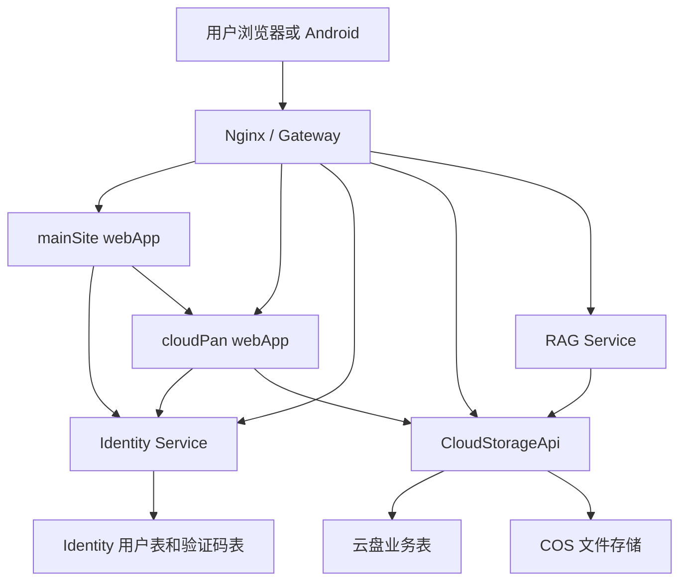

# Alicia 统一身份服务整改方案

本文档用于拆分现有云盘账号体系，把“用户身份”抽成可被主站、云盘和后续工具共同使用的独立 Identity Service。目标是稳定、高效、安全、干净地演进，不做只靠路由转发或复制用户表的临时方案。

## 1. 目标

迁移前 `CloudStorageApi` 同时承担了登录注册、用户资料、管理员账号管理、云盘额度、头像和主页背景等职责。当前登录、注册、Token、密码、公共资料和管理员身份管理已经迁入 `identityApi`；`CloudStorageApi` 只消费身份结果，并继续负责云盘资料、文件、分享、传输、容量和背景。

最终目标：

- 主站、云盘、后续工具共享同一套用户身份。
- 用户表只由 Identity Service 写入和维护。
- 云盘只保存云盘业务资料，例如容量、主页背景、文件、分享、传输等。
- 前端和移动端使用清晰分离后的路径，不再继续保留未发布阶段的旧 `/api/auth/**` 和旧 `/api/admin/users` 兼容入口。
- 生产部署能分阶段上线，每一步都有验证和回滚方式。

## 2. 核心原则

1. 公共的是身份，不是让所有业务服务直接读写同一张用户表。
2. Identity Service 是用户表、密码、邮箱验证码、登录令牌、刷新令牌、账号状态的唯一所有者。
3. CloudStorageApi 只消费身份结果，不能再直接修改密码、验证码、邮箱、账号状态。
4. 业务数据继续归业务服务所有。云盘的 `storage_node`、`share_link`、`multipart_upload_session` 等仍归云盘服务。
5. 第一期迁移优先保留现有用户 ID，避免文件归属和分享归属大规模重写。
6. 对外接口按职责分层：`/api/identity/**` 归 Identity，`/api/cloud-profile/**` 和 `/api/admin/cloud-users/**` 归云盘，`/api/storage/**`、`/api/share-links/**` 继续归云盘业务。

## 3. 当前结构复核

### 3.1 后端认证入口

当前身份接口集中在：

- `identityApi/src/main/java/com/alicia/cloudstorage/identity/controller/IdentityAuthController.java`
- `identityApi/src/main/java/com/alicia/cloudstorage/identity/controller/IdentityAdminUserController.java`

当前身份职责：

- `GET /api/identity/.well-known/jwks.json`
- `POST /api/identity/auth/login`
- `POST /api/identity/auth/register/email-code`
- `POST /api/identity/auth/register/verify`
- `GET /api/identity/auth/me`
- `POST /api/identity/auth/token/refresh`
- `POST /api/identity/auth/logout`
- `GET /api/identity/auth/sessions`
- `DELETE /api/identity/auth/sessions/{sessionId}`
- `PUT /api/identity/auth/profile`
- `PUT /api/identity/auth/password`
- `GET /api/identity/admin/users`
- `POST /api/identity/admin/users`
- `PUT /api/identity/admin/users/{userId}/password`
- `GET /api/identity/admin/audit-logs`

当前云盘资料入口：

- `GET /api/cloud-profile/me`
- `POST /api/cloud-profile/avatar`
- `GET /api/cloud-profile/avatar/{userId}`
- `POST /api/cloud-profile/background`
- `GET /api/cloud-profile/background/{userId}`
- `DELETE /api/cloud-profile/background`

现状：

- CloudStorageApi 已不再暴露旧 `AuthController`。
- 旧 `/api/auth/**` 在云盘服务侧不保留。
- 云盘主页背景、头像文件处理、容量和聚合资料归 `CloudProfileController`。

### 3.2 后端账号业务

当前 Identity 主要服务：

- `identityApi/src/main/java/com/alicia/cloudstorage/identity/service/IdentityAuthService.java`
- `identityApi/src/main/java/com/alicia/cloudstorage/identity/service/IdentityEmailRegistrationService.java`
- `identityApi/src/main/java/com/alicia/cloudstorage/identity/service/IdentityPasswordService.java`
- `identityApi/src/main/java/com/alicia/cloudstorage/identity/service/IdentityProfileService.java`
- `identityApi/src/main/java/com/alicia/cloudstorage/identity/service/IdentityAdminUserService.java`
- `identityApi/src/main/java/com/alicia/cloudstorage/identity/service/IdentityTokenService.java`

当前 CloudStorageApi 身份消费服务：

- `CloudStorageApi/src/main/java/com/alicia/cloudstorage/api/identity/HttpIdentityAuthGateway.java`
- `CloudStorageApi/src/main/java/com/alicia/cloudstorage/api/identity/HttpIdentityAdminGateway.java`
- `CloudStorageApi/src/main/java/com/alicia/cloudstorage/api/identity/HttpIdentityUserGateway.java`
- `CloudStorageApi/src/main/java/com/alicia/cloudstorage/api/principal/CurrentPrincipalService.java`
- `CloudStorageApi/src/main/java/com/alicia/cloudstorage/api/service/CloudCurrentUserService.java`
- `CloudStorageApi/src/main/java/com/alicia/cloudstorage/api/service/CloudUserProfileService.java`

现状：

- 邮箱和手机号登录、邮箱验证码注册、密码哈希和密码修改、Token 生成和校验、账号状态、公共昵称头像已由 Identity 承担。
- CloudStorageApi 通过 Identity Gateway 校验 token 和读取身份快照，不再直接写密码、邮箱验证码或账号状态。
- 云盘容量额度、主页背景、文件、分享、应用包和 RAG 仍归云盘业务。
- `sys_user` 表名暂时保留，但写入边界已经收敛到 Identity；云盘资料落在 `cloud_user_profile`。

### 3.3 管理员用户管理

当前入口：

- `identityApi/src/main/java/com/alicia/cloudstorage/identity/controller/IdentityAdminUserController.java`
- `CloudStorageApi/src/main/java/com/alicia/cloudstorage/api/controller/AdminCloudUserController.java`
- `CloudStorageApi/src/main/java/com/alicia/cloudstorage/api/controller/AdminCloudUserProfileController.java`

现有职责：

- `GET /api/admin/cloud-users`
- `POST /api/admin/cloud-users`
- `PUT /api/admin/cloud-users/{userId}/quota`
- `GET /api/identity/admin/users`
- `POST /api/identity/admin/users`
- `PUT /api/identity/admin/users/{userId}/password`

现状：

- Identity 管理账号身份和密码。
- CloudStorageApi 聚合云盘资料、已用空间、剩余额度和容量调整。
- Web 和 Android 已切换到 `/api/admin/cloud-users`，旧 `/api/admin/users` 不保留。

### 3.4 数据表

当前核心用户表：

- `sys_user`

当前字段来源：

- 初始表：`CloudStorageApi/src/main/resources/db/migration/V1__init_schema.sql`
- 容量字段：`V5__add_user_storage_quota.sql`
- 主页背景字段：`V6__add_user_home_background.sql`
- token 版本字段：`V7__add_user_token_version.sql`
- 邮箱注册字段：`V11__add_email_registration.sql`

当前 `sys_user` 字段归属判断：

| 字段 | 当前含义 | 目标归属 |
| --- | --- | --- |
| `id` | 用户主键 | Identity，保留为全局用户 ID |
| `phone_number` | 手机号登录标识 | Identity |
| `email` | 邮箱登录标识 | Identity |
| `email_verified_at` | 邮箱验证时间 | Identity |
| `nickname` | 公共昵称 | Identity |
| `avatar_url` | 公共头像 | Identity |
| `password_hash` | 密码哈希 | Identity |
| `token_version` | 登录态失效版本 | Identity |
| `role` | 当前全局角色 | Identity 第一期保留，后续可拆服务角色 |
| `status` | 账号状态 | Identity |
| `storage_quota_bytes` | 云盘容量 | CloudStorageApi |
| `home_background_url` | 云盘主页背景 | CloudStorageApi |
| `created_at` | 创建时间 | Identity |
| `updated_at` | 更新时间 | Identity |

当前验证码表：

- `email_verification_code`

目标归属：

- Identity。

当前云盘业务表引用：

- `storage_node.owner_id`
- `multipart_upload_session.owner_id`
- `share_link.owner_id`

目标语义：

- 这些字段继续表示文件、上传会话、分享的拥有者。
- 第一期不强制改列名，避免大规模迁移。
- 代码层逐步把概念从 `ownerId` 明确为 `identityUserId`。

## 4. 目标结构

### 4.1 服务结构

建议最终结构：

```text
mainSite
  webApp
    主站首页
    统一登录入口
    工具入口导航

AliciaCloudStorage
  identityApi
    用户注册
    用户登录
    邮箱验证码
    密码与登录态
    账号资料
    账号状态
    管理员身份管理

  CloudStorageApi
    文件节点
    上传下载
    分享链接
    回收站
    云盘容量
    云盘主页背景
    云盘管理员业务配置

  rag
    AI 语义服务
    继续通过 CloudStorageApi 执行业务操作

  webApp
    云盘前端
    使用 Identity 登录态

  phoneAppAdd
    Android 客户端
    使用 Identity 登录态
```

### 4.2 请求路径结构

在“不额外申请子域名证书”的方案下，推荐路径：

```text
https://windwindwind-alicia.cn/
  主站

https://windwindwind-alicia.cn/login
  统一登录入口

https://windwindwind-alicia.cn/cloudPan/
  云盘 Web

https://windwindwind-alicia.cn/api/identity/auth/**
  Identity Service

https://windwindwind-alicia.cn/api/identity/admin/**
  Identity 管理接口

https://windwindwind-alicia.cn/api/cloud-profile/**
  CloudStorageApi 云盘资料聚合、头像和背景

https://windwindwind-alicia.cn/api/admin/cloud-users/**
  CloudStorageApi 管理员云盘用户聚合和容量

https://windwindwind-alicia.cn/api/storage/**
  CloudStorageApi

https://windwindwind-alicia.cn/api/share-links/**
  CloudStorageApi

https://windwindwind-alicia.cn/api/public/share-links/**
  CloudStorageApi

https://windwindwind-alicia.cn/rag/**
  RAG Service
```

这样可以保留一个 HTTPS 证书，同时把主站和云盘从页面层分开。

### 4.3 逻辑关系



## 5. Identity Service 边界

### 5.1 Identity 拥有的能力

Identity Service 负责：

- 邮箱注册验证码发送和校验。
- 手机号或邮箱登录。
- 密码哈希、密码修改、管理员重置密码。
- Token 签发、刷新、注销、失效。
- 当前用户资料读取。
- 用户昵称、头像、邮箱、手机号。
- 账号状态：启用、停用。
- 全局角色：至少保留 `ADMIN`、`USER`。
- 管理员账号创建。

Identity Service 不负责：

- 云盘容量。
- 云盘主页背景。
- 文件、目录、分享、回收站。
- RAG 对文件的语义操作。
- 工具模块自己的业务权限细节。

### 5.2 CloudStorageApi 保留的能力

CloudStorageApi 负责：

- 文件和目录业务。
- 分享链接业务。
- 文件下载、预览、访问 URL。
- 上传任务和分片上传。
- 回收站。
- 云盘使用量统计。
- 云盘容量额度。
- 云盘主页背景。
- 云盘用户业务画像，例如是否初始化过云盘空间。

CloudStorageApi 不再负责：

- 注册登录。
- 邮箱验证码。
- 密码哈希。
- token 签发。
- 用户账号停用和密码重置。

### 5.3 主站能力

mainSite 负责：

- 工具集首页。
- 统一登录页或登录入口。
- 登录后展示用户信息和工具入口。
- 跳转云盘和后续工具。

mainSite 不直接写用户表。

## 6. 数据模型整改

### 6.1 第一期推荐表结构

为了降低迁移风险，第一期可以保留当前 `sys_user` 表名，由 Identity Service 接管它。这样已有 `owner_id` 引用不需要立刻改动。

Identity Service 拥有：

```text
sys_user
email_verification_code
identity_refresh_token
identity_audit_log
```

CloudStorageApi 新增：

```text
cloud_user_profile
```

建议 `cloud_user_profile` 字段：

| 字段 | 说明 |
| --- | --- |
| `identity_user_id` | 对应 `sys_user.id`，主键 |
| `storage_quota_bytes` | 云盘容量 |
| `home_background_url` | 云盘主页背景 |
| `created_at` | 创建时间 |
| `updated_at` | 更新时间 |

第一期数据迁移：

```text
cloud_user_profile.identity_user_id = sys_user.id
cloud_user_profile.storage_quota_bytes = sys_user.storage_quota_bytes
cloud_user_profile.home_background_url = sys_user.home_background_url
```

第一期暂时不删除 `sys_user.storage_quota_bytes` 和 `sys_user.home_background_url`，只停止新代码写入。等生产稳定后再做清理迁移。

当前已落地：

- `V12__create_cloud_user_profile.sql` 创建 `cloud_user_profile`。
- `V14__create_identity_refresh_token.sql` 创建 `identity_refresh_token`，用于记录刷新令牌会话。
- `identityApi/src/main/resources/db/identity-migration/V1__identity_schema_baseline.sql` 建立 Identity 自己的 Flyway 基线，迁移历史写入 `identity_flyway_schema_history`。
- 首次迁移时从 `sys_user.storage_quota_bytes` 和 `sys_user.home_background_url` 回填老用户云盘资料。
- `CloudUserProfileService` 通过 `CloudUserProfileRepository` 读写云盘额度和主页背景。
- `StorageQuotaService` 通过云盘资料读取器从 `cloud_user_profile` 获取容量。
- 旧 `sys_user` 字段暂时保留，只作为缺失 profile 时的兼容兜底。
- `CloudMigrationBoundaryTest` 会阻止新的身份结构变更继续进入 CloudStorageApi 的 Flyway 目录，`IdentityMigrationBoundaryTest` 会阻止云盘业务结构进入 Identity Flyway 目录。

### 6.2 第二期表结构清理

生产稳定后再考虑：

- `sys_user` 重命名为 `identity_user`。
- 删除 `sys_user.storage_quota_bytes`。
- 删除 `sys_user.home_background_url`。
- 业务表外键从数据库强 FK 改为逻辑约束，或者继续保留同库 FK。选择取决于后续是否要把 Identity 单独数据库化。

### 6.3 不建议的做法

不建议：

- 主站、云盘、未来工具都直接连 MySQL 写 `sys_user`。
- 复制一份用户表到主站。
- 让 CloudStorageApi 调 Identity 数据库，而不是调用 Identity API 或校验 Identity token。
- 一次性重命名所有 `owner_id` 列，风险高且收益不大。

## 7. Token 与鉴权整改

### 7.1 当前状态

当前 token 由 `identityApi` 的 `IdentityTokenService` 统一签发。新签发的 access token 已是标准 JWT，默认仍使用 HS256 对称签名，也可通过配置切换为 RS256 非对称签名，payload 包含：

```text
header.kid: alicia-hs256-v1
iss: https://windwindwind-alicia.cn
sub: 用户 ID
aud: alicia-tools
iat: 签发时间
exp: 过期时间
ver: token version
sid: refresh session id，可选
```

`iss`、`aud` 和 `kid` 已配置化，默认分别来自：

```text
ALICIA_AUTH_TOKEN_ISSUER=https://windwindwind-alicia.cn
ALICIA_AUTH_TOKEN_AUDIENCE=alicia-tools
ALICIA_AUTH_TOKEN_KEY_ID=alicia-hs256-v1
ALICIA_AUTH_TOKEN_PREVIOUS_KEYS=old-kid=old-secret;older-kid=older-secret
ALICIA_AUTH_TOKEN_ALGORITHM=HS256
ALICIA_AUTH_TOKEN_RSA_PRIVATE_KEY=
ALICIA_AUTH_TOKEN_RSA_PUBLIC_KEY=
ALICIA_AUTH_TOKEN_PREVIOUS_RSA_PUBLIC_KEYS=old-rsa-kid=old-public-key
```

为保证平滑升级，`IdentityTokenService` 仍兼容解析旧两段式 token。旧 v2 payload 中包含：

```text
v2:userId:tokenVersion:expiresAt
```

旧 v3 access token 绑定 refresh 会话：

```text
v3:userId:tokenVersion:refreshSessionId:expiresAt
```

已改进：

- payload 不再依赖手机号，兼容邮箱登录用户。
- 新签发 access token 已迁移为标准 JWT；旧 v2/v3 和更早期 payload 只保留解析兼容，不再新签发。
- JWT 的 `alg`、`iss`、`aud` 和 `kid` 会按配置校验，生产验证脚本会检查登录和续签返回的是三段式 JWT，并检查 JWKS 入口。
- JWT 新签发始终使用当前 key；验签支持当前 key 和配置的历史 HS256/RSA key，旧两段式 token 也可用历史 secret 验签。
- RS256/JWKS 支撑已落地，公钥发布在 `/api/identity/.well-known/jwks.json`；生产已于 2026-08-22 切换到 `RS256/alicia-rs256-20260822035821`，并保留 `alicia-hs256-v1` 作为历史 HS256 验签 key。
- `deploy/scripts/generate-identity-rs256-env.sh` 可生成 PKCS#8 私钥、X.509 公钥和 `.env` 片段，输出目录 `deploy/generated/` 已被 git 忽略；从 HS256 切到 RS256 时，如果 `.env` 未显式配置 `ALICIA_AUTH_TOKEN_KEY_ID`，脚本按 compose 默认 `alicia-hs256-v1` 保留当前 HS256 secret 到历史验签 key。
- `deploy/scripts/verify-identity-rs256-dry-run.sh` 可在不修改生产 `.env` 的前提下临时启动 RS256 identity，完成统一验证后默认恢复当前配置。
- `deploy/scripts/prepare-identity-rs256-cutover-env.sh` 可生成正式切换用的候选 `.env`，并输出备份、切换和回滚命令，默认不直接覆盖生产 `.env`；旧 snippet 缺少 `ALICIA_AUTH_TOKEN_PREVIOUS_KEYS` 时会从当前 `.env` 推导旧 HS256 兼容项。
- `deploy/scripts/prepare-identity-hs256-key-removal-env.sh` 可在旧 HS256 access token 观察期结束后生成候选 `.env`，从 `ALICIA_AUTH_TOKEN_PREVIOUS_KEYS` 中移除指定历史 `kid`，默认目标是 `alicia-hs256-v1`，并输出切换与回滚命令；生成目录下的 `.env`、candidate 和 backup 都按敏感文件处理，保持 `600` 权限。
- `tokenVersion` 已用于密码修改、管理员重置密码和全设备 logout 后的登录态失效。
- `identity_refresh_token` 保存刷新令牌摘要、用户、tokenVersion、过期时间、撤销时间、客户端 IP 和 User-Agent。
- 登录和邮箱注册验证返回 `token` 与 `refreshToken`；续签优先使用 refresh token 轮换，Authorization-only 续签作为兼容路径保留并会补发刷新会话。
- 默认 logout 只撤销当前 refresh 会话；传 `{"allDevices":true}` 时撤销该用户全部 refresh 会话并递增 `token_version`。
- 指定刷新会话撤销会单独记录 `SESSION_REVOKE` 审计事件，避免和普通 logout 混在一起。
- CloudStorageApi 不再本地解析旧 token 或查询本地用户表，而是通过 Identity 当前用户接口校验。

剩余问题：

- 当前生产签发已切到 RS256；后续需要在旧 HS256 access token 过期后移除 `ALICIA_AUTH_TOKEN_PREVIOUS_KEYS` 中的历史 HS256 key。
- CloudStorageApi 现在通过 HTTP 调 Identity 校验 token，并已为 Identity HTTP 客户端设置可配置连接/读取超时；后续如果流量增大，需要短缓存、introspection 或 JWKS 本地验签方案。
- 当前不直接把 CloudStorageApi 切为纯本地 JWKS 验签，因为 access token 暂不写入角色和账号状态；管理员权限、禁用账号、`tokenVersion` 失效仍由 Identity 强一致校验。后续可以先做短缓存或本地验签 + Identity 状态快照组合，再评估是否减少 `/api/identity/auth/me` 同步调用。

### 7.2 后续目标

Identity Service 中期切换非对称 JWT/JWKS：

```text
header.kid: 当前签名密钥 ID
iss: https://windwindwind-alicia.cn
sub: 用户 ID
aud: alicia-tools
ver: token version
iat: 签发时间
exp: 过期时间
```

推荐：

- 第一期对称签名阶段已完成；HS256 JWT 签发、旧 token 解析兼容、JWT 元数据配置化、基础校验和历史 key 验签窗口已落地。
- 生产非对称签名和 JWKS 切换已完成；后续重点是让 CloudStorageApi、RAG 或后续服务逐步使用 JWKS 本地验签，只持有公钥。
- 保留 token version，用于密码修改和管理员重置密码后的登录态失效。
- 角色和状态暂不写入 access token，仍由 Identity 校验时读取数据库，避免角色/状态变更后出现过期授权信息。

### 7.3 CloudStorageApi 鉴权改造

已落地：

- `CurrentPrincipalInterceptor` 通过 `CurrentPrincipalService` 调 Identity 校验 token，并写入 `CurrentPrincipal`。
- `AdminPrincipalInterceptor` 基于 `CurrentPrincipal.role` 校验管理员接口。
- `CurrentPrincipal` 当前只在云盘服务内保存 `userId` 和 `role`，账号状态和 token version 由 Identity 在校验时处理。
- 普通业务接口只接收当前主体或用户 ID，不再接收完整身份实体。
- CloudStorageApi 到 Identity 的 HTTP 调用已设置 `ALICIA_IDENTITY_API_CONNECT_TIMEOUT_MS` 和 `ALICIA_IDENTITY_API_READ_TIMEOUT_MS`，避免上游身份服务慢响应拖住云盘请求。

后续可增强：

- 为 Identity 当前用户校验增加短缓存，降低 CloudStorageApi 到 Identity 的频繁往返。
- 切换 JWT/JWKS 后，CloudStorageApi 可本地验签，只在需要强一致状态时调用 Identity。

## 8. 接口整改清单

### 8.1 Identity 对外接口

当前采用清晰分离路径，不再让 CloudStorageApi 继续承担 `/api/auth/**` 兼容入口：

| 方法 | 路径 | 归属 |
| --- | --- | --- |
| `POST` | `/api/identity/auth/login` | Identity |
| `POST` | `/api/identity/auth/register/email-code` | Identity |
| `POST` | `/api/identity/auth/register/verify` | Identity |
| `GET` | `/api/identity/auth/me` | Identity |
| `POST` | `/api/identity/auth/token/refresh` | Identity |
| `POST` | `/api/identity/auth/logout` | Identity |
| `GET` | `/api/identity/auth/sessions` | Identity |
| `DELETE` | `/api/identity/auth/sessions/{sessionId}` | Identity |
| `PUT` | `/api/identity/auth/profile` | Identity |
| `PUT` | `/api/identity/auth/password` | Identity |
| `GET` | `/api/identity/admin/users` | Identity |
| `POST` | `/api/identity/admin/users` | Identity |
| `PUT` | `/api/identity/admin/users/{userId}/password` | Identity |
| `GET` | `/api/identity/admin/audit-logs` | Identity |

后续建议：

| 方法 | 路径 | 说明 |
| --- | --- | --- |
| `GET` | `/api/identity/.well-known/jwks.json` | Identity RS256 公钥发布 |

### 8.2 CloudStorageApi 对外接口

保留：

- `/api/storage/**`
- `/api/share-links/**`
- `/api/public/share-links/**`
- `/api/app-package/**`
- `/api/admin/app-package/**`

已迁移：

| 当前接口 | 调整 |
| --- | --- |
| `/api/auth/me` | 移到 `/api/cloud-profile/me` |
| `/api/auth/avatar` | 移到 `/api/cloud-profile/avatar` |
| `/api/auth/avatar/{userId}` | 移到 `/api/cloud-profile/avatar/{userId}` |
| `/api/auth/background` | 移到 `/api/cloud-profile/background` |
| `/api/auth/background/{userId}` | 移到 `/api/cloud-profile/background/{userId}` |
| `/api/admin/users` | 移到 `/api/admin/cloud-users` |
| `/api/admin/users/{userId}/quota` | 移到 `/api/admin/cloud-users/{userId}/quota` |

兼容策略：

- 当前应用尚未正式发布，旧 `/api/auth/background` 路径不再保留。
- 当前应用尚未正式发布，旧 `/api/auth/me`、`/api/auth/avatar` 路径不再保留。
- 当前应用尚未正式发布，旧 `/api/admin/users` 和 `/api/admin/users/{userId}/quota` 路径不再保留。
- Web 已直接调用 `/api/cloud-profile/me`、`/api/cloud-profile/avatar` 和 `/api/cloud-profile/background`。
- Web 和 Android 已直接调用 `/api/admin/cloud-users` 和 `/api/admin/cloud-users/{userId}/quota`。
- Android 已直接调用 `/api/cloud-profile/me` 和 `/api/cloud-profile/avatar`；当前只读取 `homeBackgroundUrl` 响应字段，未发现上传/清空背景接口调用。

### 8.3 管理端拆分

Identity 管理：

- 创建用户。
- 停用用户。
- 重置密码。
- 修改全局角色。
- 查看用户基础资料。

Cloud 管理：

- 调整云盘容量。
- 查看云盘用量。
- 查看云盘用户初始化状态。

前端可以继续一个“用户管理”面板，但数据来源拆成两块：

- Identity 用户列表。
- Cloud 用户容量和使用量。

## 9. 前端整改位置

### 9.1 云盘 Web

当前相关位置：

- `webApp/src/lib/api.ts`
- `webApp/src/lib/session.ts`
- `webApp/src/lib/unifiedLogin.ts`
- `webApp/src/context/session-context.tsx`
- `webApp/src/components/protected-route.tsx`
- `webApp/src/pages/UnifiedLoginRedirectPage.tsx`
- `webApp/src/pages/DrivePage.tsx`
- `webApp/src/features/drive/hooks/useDriveProfileSettings.ts`
- `webApp/src/features/drive/hooks/useDriveAccountsAdmin.ts`
- `webApp/src/components/UserManagementPanel.tsx`
- `webApp/src/features/drive/DriveProfileModals.tsx`

改造方向：

1. 登录和注册由 mainSite `/login` 承载，云盘 Web 不再拥有独立登录页面。
2. 云盘未登录或 token 过期时跳转 `/login?returnTo=/cloudPan/`。
3. 云盘 Web 启动时先调用 `/api/identity/auth/token/refresh`，优先使用本地 refresh token 续签，再读取 `/api/cloud-profile/me`。
4. 云盘 Web 运行中定时续签 token，主动退出登录时调用 `/api/identity/auth/logout` 撤销当前 refresh 会话后再清理本地会话。
5. 云盘 Web 头像菜单已接入“登录会话”，可读取当前账号 refresh 会话并撤销非当前有效会话。
6. `User` 类型后续再拆成：
   - `IdentityUser`
   - `CloudUserProfile`
   - 页面聚合用的 `CurrentUserView`
7. `homeBackgroundUrl` 不再来自 `/api/auth/me`，而来自 `/api/cloud-profile/me` 聚合响应。
8. 用户管理面板拆分身份字段和云盘额度字段。

### 9.2 Android

当前相关位置：

- `phoneAppAdd/app/src/main/java/com/alicia/cloudstorage/phone/data/AliciaCloudApi.kt`
- `phoneAppAdd/app/src/main/java/com/alicia/cloudstorage/phone/data/AliciaRepository.kt`
- `phoneAppAdd/app/src/main/java/com/alicia/cloudstorage/phone/data/SessionStore.kt`
- `phoneAppAdd/app/src/main/java/com/alicia/cloudstorage/phone/ui/MainViewModel.kt`

改造方向：

1. 登录、邮箱验证码、注册、资料写入和密码变更直接调用 `/api/identity/**`。
2. 当前用户云盘聚合资料直接调用 `/api/cloud-profile/me`。
3. 头像上传和头像展示直接调用 `/api/cloud-profile/avatar`。
4. 云盘容量、背景等由 CloudStorageApi 获取。
5. SessionStore 保存 access token 和 refresh token，启动恢复时先调用 `/api/identity/auth/token/refresh` 续签。
6. 主动退出登录时调用 `/api/identity/auth/logout`，然后清理本地 token 和 refresh token。
7. 修改密码成功后立即清理本地 token，引导用户使用新密码重新登录。
8. SessionStore 存储 token 的 key 可以后续改名，第一期不强制。

### 9.3 主站 mainSite

当前主站相关位置：

- `F:/webProject/mainSite/webApp/src/App.tsx`
- `F:/webProject/mainSite/compose.yaml`
- `F:/webProject/mainSite/.env.example`
- `F:/webProject/mainSite/deploy/README.md`

当前状态和方向：

1. 主站从工具入口升级为统一入口。
2. `/login` 页面调用 Identity 的 `/api/identity/auth/login`。
3. 登录成功后根据 `returnTo` 跳转，例如 `/cloudPan/`。
4. 工具卡片进入云盘时带当前登录态，由同域 localStorage 或 cookie 读取。
5. 如果使用同域路径部署，云盘地址改成 `/cloudPan/`，不再强依赖 `pan` 子域名。

## 10. 部署结构整改

### 10.1 Compose

当前 `compose.yaml` 已包含：

- `db`
- `identity`
- `api`
- `rag`
- `frontend`

当前生产还保留独立 `~/mainSite` compose，主站容器通过内网端口提供给云盘仓库中的 Nginx gateway。

当前结构：

```text
db
identity
api
rag
frontend-gateway
main-site-frontend（独立仓库/独立 compose）
```

其中：

- `identity` 连接同一个 MySQL。
- `api` 不再直接管理 `sys_user`，只管理云盘业务。
- `frontend-gateway` 继续占用 80/443，负责路由。
- `main-site-frontend` 内网端口暴露给 gateway，后续可再评估是否合并到同一个 compose。

### 10.2 Nginx 路由

当前路由：

```text
/                         -> main-site-frontend
/login                    -> main-site-frontend
/cloudPan/                -> cloud webApp static
/api/identity/health      -> identity
/api/identity/.well-known/jwks.json -> identity
/api/identity/auth/       -> identity
/api/identity/admin/      -> identity
/api/cloud-profile/       -> cloud api
/api/admin/cloud-users/   -> cloud api
/api/storage/             -> cloud api
/api/share-links/         -> cloud api
/api/public/share-links/  -> cloud api
/api/app-package/         -> cloud api
/api/admin/app-package/   -> cloud api
/rag/                     -> rag
```

云盘内部旧路径：

```text
/cloudPan/login           -> /login?returnTo=/cloudPan/
```

根路径 `/share/{code}` 不再作为云盘分享兼容入口；主站后续如果需要分享能力，由 mainSite 自己接管。

## 11. 分阶段实施计划

### 阶段 0：冻结边界和文档

目标：

- 明确拆分范围。
- 不改生产逻辑。
- 不改数据库。

交付：

- 本文档。

验证：

- `git diff --check`
- 确认只新增文档。

### 阶段 1：在 CloudStorageApi 内部先拆边界

目标：

- 不新增服务，先把代码边界拆开。
- 为后续抽服务降低风险。

已落地改动：

1. 新增 `CurrentPrincipal`，业务服务不再传 `SysUser`。
2. 新增 `CloudUserProfileService`、`CloudCurrentUserService`、`CloudUserAvatarService`，将云盘资料、头像文件处理、容量和主页背景从身份职责中拆出。
3. 新增 `CloudUserProfileProvisioningService`，Identity 新用户首次访问云盘受保护接口时自动补建 `cloud_user_profile`。
4. 管理员云盘聚合入口统一到 `AdminCloudUserController` 和 `AdminCloudUserProfileController`。
5. `StorageQuotaService` 通过 `StorageQuotaAccountReader` 读取身份角色和云盘容量，不再把完整用户实体作为业务依赖。
6. 新增 `cloud_user_profile` 表，老用户从 `sys_user` 回填云盘额度和主页背景。
7. `CloudUserProfileService` 写入 `cloud_user_profile`，不再把云盘背景和额度写回 `sys_user`。
8. `StorageQuotaService` 通过 `cloud_user_profile` 读取容量，旧 `sys_user` 字段只保留为清理前的历史字段。

验证：

- `.\mvnw.cmd -pl CloudStorageApi test` 通过。
- Web 登录、注册、修改资料、上传头像、背景、管理员用户管理都通过。
- Android 登录、注册、个人资料、云盘首页通过。

### 阶段 2：新增 Identity Service

目标：

- 新增独立 Spring Boot 服务。
- 先接管当前 `sys_user` 和 `email_verification_code` 表。
- 对外路径使用 `/api/identity/auth/**` 和 `/api/identity/admin/**`。

当前已落地骨架：

```text
AliciaCloudStorage/identityApi
```

已包含：

- Maven 子模块：`identity-api`。
- 应用入口：`IdentityApiApplication`。
- 独立健康检查：`GET /api/identity/health`。
- 只读身份模型：`IdentityUser`，映射现有 `sys_user` 身份字段。
- 身份 Repository：`IdentityUserRepository`，当前支持读取用户和创建邮箱注册用户。
- 内部只读查询接口：`GET /api/identity/internal/users/{userId}`。
- 内部登录验证接口：`POST /api/identity/auth/login`。
- 内部当前用户接口：`GET /api/identity/auth/me`。
- 内部 Token 续签接口：`POST /api/identity/auth/token/refresh`，优先使用 `refreshToken` 请求体并轮换刷新令牌。
- 内部注销接口：`POST /api/identity/auth/logout`，默认撤销当前 refresh 会话，`allDevices=true` 时递增 `token_version` 并撤销全部 refresh 会话。
- 内部会话查询接口：`GET /api/identity/auth/sessions`，返回当前用户刷新会话元数据，不暴露 refresh token 或 token hash。
- 内部会话撤销接口：`DELETE /api/identity/auth/sessions/{sessionId}`，只允许撤销当前用户自己的刷新会话。
- 内部邮箱验证码发送接口：`POST /api/identity/auth/register/email-code`。
- 内部邮箱验证码注册接口：`POST /api/identity/auth/register/verify`。
- 邮件发送配置：`alicia.mail.*`，identity 容器复用现有 SMTP 环境变量。
- 邮箱注册当前只创建身份用户，云盘 `cloud_user_profile` 由 CloudStorageApi 在消费身份用户时负责补建。
- CloudStorageApi 已新增 `CloudUserProfileProvisioningService`，鉴权通过后会确保当前身份用户存在云盘 profile。
- identity 新用户的云盘 profile 默认额度取 `alicia.storage.default-user-quota-bytes`，不再误用 `sys_user.storage_quota_bytes` 的旧数据库默认值。
- `IdentityRefreshTokenService` 使用 `JdbcTemplate` 读写 `identity_refresh_token`，避免把刷新会话表暴露为额外 JPA 实体；该表已纳入 `identityApi` 独立 Flyway 基线。
- `IdentityTokenService` 已签发标准 JWT，并保留旧两段式 token 解析兼容；代码默认 HS256，生产 `.env` 已切到 RS256/JWKS。
- Compose 中注入同一个 MySQL 连接；共享库过渡期由 `api` 先完成 CloudStorageApi 历史迁移，再启动 `identity` 执行自己的 Flyway 与 JPA validate。
- Dockerfile：`identityApi/Dockerfile`。
- README：`identityApi/README.md`。

当前模块：

```text
identityApi
  controller
    IdentityAuthController
    IdentityAdminUserController
    IdentityHealthController
    IdentityInternalUserController
  service
    IdentityAuthService
    IdentityEmailRegistrationService
    IdentityPasswordService
    IdentityProfileService
    IdentityAdminUserService
    IdentityPrincipalService
    IdentityTokenService
    IdentityRefreshTokenService
  entity
    IdentityUser
    EmailVerificationCode
  repository
    IdentityUserRepository
    EmailVerificationCodeRepository
  mail
    EmailSender
    SmtpEmailSender
```

说明：

- Identity 当前仍映射既有 `sys_user` 表，后续再决定是否迁移到独立库或重命名为 `identity_user`。
- 头像文件上传仍由 CloudStorageApi 承担，Identity 只保存公共 `avatarUrl` 字段。
- 不要把 `StorageQuotaService` 带进 Identity。

验证：

- `.\mvnw.cmd -pl identityApi test` 通过。
- `http://127.0.0.1:8093/api/identity/health` 可用。
- `http://127.0.0.1:8093/api/identity/internal/users/1` 可读取身份资料，响应不包含 `passwordHash`。
- `POST http://127.0.0.1:8093/api/identity/auth/login` 可验证老用户密码并返回 token 与 refreshToken。
- `GET http://127.0.0.1:8093/api/identity/auth/me` 可用 identity token 读取当前用户。
- `POST http://127.0.0.1:8093/api/identity/auth/token/refresh` 可使用 refreshToken 续签并轮换刷新令牌。
- `POST http://127.0.0.1:8093/api/identity/auth/logout` 可撤销当前 refresh 会话，或通过 `allDevices=true` 让当前用户所有 token 失效。
- `GET http://127.0.0.1:8093/api/identity/auth/sessions` 可读取当前账号刷新会话列表。
- `DELETE http://127.0.0.1:8093/api/identity/auth/sessions/{sessionId}` 可撤销当前账号自己的指定刷新会话。
- `POST http://127.0.0.1:8093/api/identity/auth/register/email-code` 可发送注册验证码。
- `POST http://127.0.0.1:8093/api/identity/auth/register/verify` 可创建邮箱注册身份用户并返回 identity token。
- 使用 identity 注册返回的 token 请求 CloudStorageApi 受保护接口时，CloudStorageApi 会自动补建 `cloud_user_profile`。
- 生产 Nginx 已把 `/api/identity/health`、`/api/identity/auth/**` 和 `/api/identity/admin/**` 路由到 identity 容器。

### 阶段 3：CloudStorageApi 切换为 Identity token 消费方

目标：

- CloudStorageApi 不再签发 token。
- CloudStorageApi 不再写用户密码、邮箱验证码。
- CloudStorageApi 只校验 Identity token 并拿到当前用户 ID。

已落地改动：

1. 通过 `IdentityAuthGateway` 调用 Identity 的当前用户接口。
2. CloudStorageApi 中对 `SysUserRepository` 的身份写依赖已删除。
3. `CurrentPrincipalInterceptor` 写入 `CurrentPrincipal` 和 `CURRENT_USER_ID`。
4. 保持现有 `cloud_user_profile` 作为云盘用户资料来源。
5. CloudStorageApi 中登录、注册、资料写入、密码修改、管理员身份管理均已切到 Identity API 或移除旧实现。
6. 旧 `/api/auth/**` 在 CloudStorageApi 不再保留。

验证：

- 老用户登录后文件列表仍是原文件。
- 老用户容量显示正确。
- 管理员仍可访问云盘管理页。
- 密码修改后旧 token 失效。

### 阶段 4：Web 和 Android 路径迁移

目标：

- 用户无感切换到 Identity。
- 前端结构逐步干净。

已落地改动：

1. Web `api.ts` 中登录、注册、资料、密码、管理员身份接口直接调用 `/api/identity/**`。
2. Web 当前用户云盘聚合资料、头像和背景直接调用 `/api/cloud-profile/**`。
3. Web 管理员云盘聚合用户列表和创建直接调用 `/api/admin/cloud-users`，容量调整调用 `/api/admin/cloud-users/{userId}/quota`。
4. Android `AliciaCloudApi.kt` 已同步 Identity、Cloud profile 和 Cloud users 路径。
5. 旧 `/api/auth/**`、旧 `/api/admin/users` 不保留。

验证：

- Web 登录注册。
- Android 登录注册。
- 邮箱验证码。
- 修改密码。
- 头像。
- 主页背景。
- 管理员创建用户、重置密码、改容量。

### 阶段 5：主站接入统一登录

目标：

- 主站成为统一入口。
- 云盘不再是唯一账号入口。

当前状态和建议：

1. mainSite 作为 `/` 和 `/login` 的统一入口。
2. mainSite 调 `/api/identity/auth/login` 和 `/api/identity/auth/me`。
3. 云盘未登录跳转主站 `/login?returnTo=/cloudPan/`。
4. 工具卡片按登录状态展示进入、未登录、即将上线等状态。

验证：

- `https://windwindwind-alicia.cn/` 打开主站。
- 主站登录后可进入 `/cloudPan/`。
- 直接打开 `/cloudPan/` 未登录时能回到登录页。
- 登录后刷新页面不丢状态。

### 阶段 6：清理旧字段和旧代码

目标：

- 删除旧字段。
- 减少重复数据来源。

清理条件：

- 生产至少稳定一个版本周期。
- Web 和 Android 都已发布并验证。
- 后端日志无旧接口依赖。

可清理：

- `sys_user.storage_quota_bytes`。
- `sys_user.home_background_url`。
- 文档和部署脚本中残留的旧 `/api/auth/**` 说明。

## 12. 回滚策略

每个阶段都要保证能回滚：

| 阶段 | 回滚方式 |
| --- | --- |
| 阶段 1 | 回退代码即可；新增 `cloud_user_profile` 表保留不影响旧代码，回滚时不要删除旧 `sys_user` 字段 |
| 阶段 2 | 当前 identity 已接生产身份流量，回滚需要同时回退前端路径、Nginx 路由和 CloudStorageApi Identity Gateway |
| 阶段 3 | 当前 CloudStorageApi 已消费 Identity token，回滚需要恢复旧身份实现和旧前端路径，不建议作为常规回滚手段 |
| 阶段 4 | 当前客户端已迁移到新路径，回滚需同步回退 Web 和 Android |
| 阶段 5 | 网关根路径可临时切回云盘前端 |
| 阶段 6 | 清理前必须有数据库备份，不直接回滚已删除字段 |

## 13. 测试清单

后端：

- 邮箱验证码发送。
- 验证码过期。
- 验证码错误次数限制。
- 邮箱已注册不泄露过多信息。
- 邮箱注册成功后自动登录。
- 邮箱和手机号登录。
- 修改密码后旧 token 失效。
- 管理员重置密码后旧 token 失效。
- 停用用户不可登录、不可访问云盘。
- 普通用户不能访问管理员接口。
- 管理员可以修改云盘容量。
- 容量不能低于已用空间。
- 老用户文件归属不变。

Web：

- 主站登录。
- 云盘登录。
- 注册验证码。
- 登录后刷新。
- 未登录访问云盘重定向。
- 分享页登录跳转。
- 用户资料修改。
- 头像上传。
- 云盘主页背景上传和清除。
- 管理员用户面板。
- 管理员身份审计日志查询。

Android：

- 登录。
- 注册。
- 自动恢复登录态。
- token 过期处理。
- 云盘首页。
- 文件列表。
- 上传下载。
- 分享。
- AI 操作。

部署：

- `/api/health`
- `/api/identity/auth/me`
- `/api/identity/admin/audit-logs`
- `/api/cloud-profile/me`
- `/api/admin/cloud-users`
- `/api/storage/overview`
- `/rag/api/health`
- `/`
- `/login`
- `/cloudPan/`

生产更新 `api`、`identity` 或前端 Nginx 后，可在服务器仓库内执行：

```bash
bash deploy/scripts/verify-identity-cloud-routes.sh
```

提交或部署前可先执行静态边界扫描：

```bash
bash deploy/scripts/check-identity-route-boundary.sh
```

该脚本检查源码和部署配置中是否重新出现旧 `/api/auth/**` 或旧 `/api/admin/users` 引用，并检查 Identity 源码/迁移是否重新引用云盘画像字段；同时排除运行验证脚本里的旧路由 404 断言。优先使用 `rg`，服务器未安装 `rg` 时自动降级到 `grep`。

同一边界也由 `CloudStorageApi` 的 `IdentityRouteBoundaryTest` 纳入 Maven 测试，避免只依赖部署脚本人工执行。

脚本覆盖：

- 直连与前端 Nginx health，并检查 CloudStorageApi 到 Identity 的依赖健康端点、Identity 数据库/Flyway 依赖健康端点。
- Identity 登录、refresh token 下发与轮换、JWT `alg/iss/aud/kid` 元数据、JWKS 入口、刷新会话查询、指定刷新会话撤销、会话撤销审计事件写入、logout 后 refresh token 和当前 access token 失效。
- `/api/cloud-profile/me` 和 `/api/storage/overview` 使用 identity token。
- `/api/admin/cloud-users` 管理员入口。
- `/api/identity/admin/audit-logs` 管理员审计日志查询入口和 `SESSION_REVOKE` 筛选。
- 旧 `/api/auth/me`、`/api/auth/avatar/{userId}`、`/api/admin/users` 保持 404。
- `identity_audit_log` 最新记录查询。

## 14. 当前优先整改位置

当前第一轮身份拆分已经落地，后续重点转为增强 Identity 独立性和清理历史字段。

Identity：

- `identityApi/src/main/java/com/alicia/cloudstorage/identity/service/IdentityTokenService.java`
- `identityApi/src/main/java/com/alicia/cloudstorage/identity/service/IdentityPrincipalService.java`
- `identityApi/src/main/java/com/alicia/cloudstorage/identity/service/IdentityRefreshTokenService.java`
- `identityApi/src/main/java/com/alicia/cloudstorage/identity/controller/IdentityAuthController.java`
- 后续如果做后台密钥管理，再新增密钥实体和 Repository；当前 RS256/JWKS 先由环境变量驱动。

CloudStorageApi：

- `CloudStorageApi/src/main/java/com/alicia/cloudstorage/api/identity/*Gateway.java`
- `CloudStorageApi/src/main/java/com/alicia/cloudstorage/api/principal/CurrentPrincipalService.java`
- `CloudStorageApi/src/main/java/com/alicia/cloudstorage/api/service/CloudUserProfileProvisioningService.java`
- `CloudStorageApi/src/main/java/com/alicia/cloudstorage/api/service/CloudUserProfileService.java`
- `CloudStorageApi/src/main/java/com/alicia/cloudstorage/api/service/StorageQuotaService.java`
- `CloudStorageApi/src/test/java/com/alicia/cloudstorage/api/architecture/IdentityRouteBoundaryTest.java`

Web 和 Android：

- 主站 `/login` 与云盘 `/cloudPan/` 的共享登录态体验。
- 主站登录页保存 `refreshToken`，和云盘 Web/Android 使用同一套 refresh 会话。
- Web 和 Android 的 token 过期提示和重新登录体验。
- 管理员面板中身份信息和云盘容量信息的展示边界。
- Web 管理员身份审计日志筛选体验。

部署：

- `compose.yaml`
- `webApp/nginx/default.conf`
- `webApp/nginx/default.ssl.conf`
- 生产服务器 `~/aliciaCloudStorage/.env`

## 15. 推荐下一步

下一步按风险从低到高推进：

1. 保持旧 `sys_user.storage_quota_bytes` 和 `sys_user.home_background_url` 一个版本周期不删，只观察不写入。
2. 继续观察 Identity 审计日志写入、查询接口和 Web 管理页筛选结果。
3. 观察 `identity_refresh_token` 的生产写入、轮换、会话查询和指定会话撤销结果。
4. 继续观察 `identity_flyway_schema_history`，确认后续身份 schema 变更只进入 `identityApi` 迁移目录，并保持双向迁移边界测试通过。
5. 观察 RS256 生产签发、JWKS 公钥发布和历史 HS256 验签窗口，旧 access token 过期后用 `deploy/scripts/prepare-identity-hs256-key-removal-env.sh` 准备候选 `.env` 并移除历史 HS256 key。
6. 评估 CloudStorageApi / RAG 后续是否改为 JWKS 本地验签，减少对 Identity `/auth/me` 的同步依赖。
7. 评估 `sys_user` 是否继续作为 identity 表名，或迁移到独立 schema / `identity_user`。

这一步完成后，当前文档基线已经与生产架构对齐：Identity 负责身份，CloudStorageApi 负责云盘，主站负责统一入口。后续新增工具只需要接入 Identity，不应该再直接复用或写入云盘的用户资料表。
