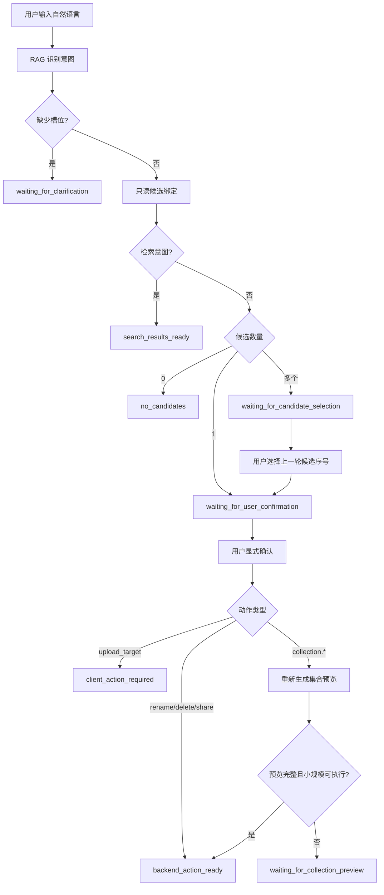

# Alicia RAG Action Bridge Contract

本文档定义 RAG 文件助手在用户确认后交付给调用方的执行桥接草稿。RAG 服务只负责识别、引导、候选绑定和生成请求草稿，不直接执行真实文件变更。

## 接口入口

- `POST /api/assistant/plan`：提交用户自然语言和可选 `conversationId`，返回意图模板。
- `GET /api/assistant/contracts/action-bridge`：返回当前生效的动作桥接配置，仅允许 `RAG_ADMIN` 访问。

调用 `POST /api/assistant/plan` 时，可携带用户自己的 `Authorization` 请求头。该请求头只用于 RAG 服务向 CloudStorageApi 做只读候选查询，不写入会话状态，也不会出现在响应体。

正式客户端不应让普通用户运行时读取 `/api/assistant/contracts/**` 内部契约；移动端和 Web 应内置经过版本确认的 allowlist，契约接口保留给管理员诊断、部署验证和开发联调。

移动端还可通过 `clientContext.availableClientInputs` 只提交客户端已具备的输入数量，例如 `{ "files": 3, "folders": 1 }`。RAG 只用这些计数判断 `requiredClientFields` 是否已满足；本地 URI、路径和文件名不得发给 RAG。

## 状态流

## 响应字段

`backendActionDraft` 默认返回 `not_requested`，只有用户已经显式确认、并且真实候选已锁定时才会进入可交付状态。

关键字段：

- `status`：执行草稿状态，例如 `backend_action_ready`、`client_action_required`、`missing_candidate_fields`。
- `actionType`：受控动作类型，例如 `rename`、`delete`、`share`、`upload_target`。
- `nextAction`：调用方下一步，例如 `handoff_to_backend` 或 `handoff_to_client_upload`。
- `executableByBackend`：是否可由调用方提交到 CloudStorageApi。
- `authorizationRequired`：提交 CloudStorageApi 时是否必须携带用户授权。
- `method`、`path`、`queryParameters`、`body`：调用方请求草稿。
- `requiredClientFields`：仍需客户端补充的字段。上传目标定位会要求 `files`；若 `clientContext.availableClientInputs.files > 0`，计划与草稿会将该字段视为已满足。
- `targetCandidate`：上一轮 CloudStorageApi 只读候选查询返回并经用户选择或确认的真实候选。

集合动作会在用户确认轮重新生成只读预览。只有预览状态为完整、预览候选覆盖全部匹配项、所有候选都具备 `nodeId` 时，才会生成批量请求草稿。

## 提交规则

调用方只允许在以下条件全部满足时提交 CloudStorageApi：

- `backendActionDraft.status = backend_action_ready`
- `backendActionDraft.nextAction = handoff_to_backend`
- `backendActionDraft.executableByBackend = true`
- 单对象动作必须有 `backendActionDraft.targetCandidate.nodeId`
- 批量动作必须有非空 `backendActionDraft.body.nodeIds`
- 当前用户已显式确认本轮操作
- 请求方法和路径命中调用方本地 allowlist

上传目标定位不直接提交普通 JSON 执行：

- `backendActionDraft.status = client_action_required`
- `backendActionDraft.nextAction = handoff_to_client_upload`
- 调用方必须已有本地选择，或先让用户选择本地文件/文件夹
- 再调用 `POST /api/storage/files?parentId={nodeId}`，以 `multipart/form-data` 上传

## CloudStorageApi 安全边界

CloudStorageApi 必须继续把 RAG 输出视为不可信输入：

- 使用当前请求的用户 `Authorization` 鉴权，不接受 RAG 代传身份。
- 根据 `nodeId` 再次校验节点归属、删除状态、目录/文件类型和业务约束。
- 使用现有 DTO 校验请求体，例如 `RenameNodeRequest`、`CreateShareLinkRequest`。
- 不允许新增“按 RAG 草稿绕过校验”的批量执行入口。
- 所有真实变更仍由现有服务层完成，并触发已有存储事件发布流程。

## 当前动作映射

- `rename`：`PUT /api/storage/nodes/{nodeId}/rename`，body 为 `{ "name": new_name }`。
- `delete`：`DELETE /api/storage/nodes/{nodeId}`，移动到回收站。
- `share`：`POST /api/share-links`，body 包含 `nodeIds`、`title` 和默认分享选项。
- `upload_target`：客户端逐个调用 `POST /api/storage/files?parentId={nodeId}`，需要客户端补充一个或多个本地文件；目录上传由客户端先创建同名目录并递归逐文件提交。
- `collection.trash_by_name_contains`：`POST /api/storage/nodes/batch/trash`，body 为 `{ "nodeIds": [...] }`。
- `collection.trash_by_category`：`POST /api/storage/nodes/batch/trash`，body 为 `{ "nodeIds": [...] }`。
- `collection.move_by_extension`：`PUT /api/storage/nodes/batch/move`，body 为 `{ "nodeIds": [...], "parentId": targetParentId }`。
- `collection.move_by_name_contains`：`PUT /api/storage/nodes/batch/move`，body 为 `{ "nodeIds": [...], "parentId": targetParentId }`。

动作映射以 `rag/conversation/action_bridge.json` 为准，扩展新动作时优先改配置，再补测试。
