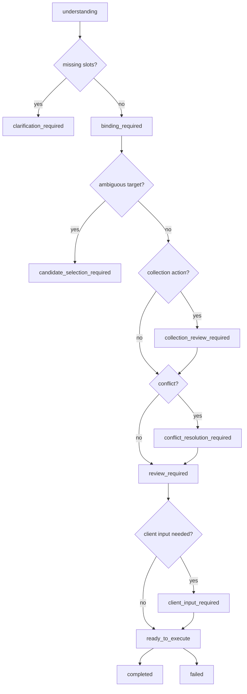

# Alicia RAG ActionPlan Design

本文档定义 Alicia 云盘 RAG 助手的会话式行动规划模型。它用于把用户的自然语言请求逐步转换为安全、可审计、可扩展的 `ActionPlan`，再由移动端的本地白名单执行器调用 CloudStorageApi。

## 目标

- 支持单对象动作、组合动作、集合批量动作。
- 支持中文、英文和混合表达，但内部枚举保持稳定。
- 支持多阶段追问、候选确认、冲突确认和最终确认。
- RAG 服务只负责理解、绑定、规划，不直接执行真实文件变更。
- 移动端只执行本地 allowlist 中的动作 Handler，不接受 RAG 返回的任意 URL。

## 边界

RAG 服务负责：

- 识别意图和槽位。
- 维护会话状态。
- 请求 CloudStorageApi 做只读候选绑定。
- 生成 `ActionPlan`。
- 渲染面向用户的引导文案。

移动端负责：

- 展示候选、冲突、集合预览和最终确认。
- 保管本地文件 URI 等客户端输入。
- 校验 `ActionPlan` 是否命中本地白名单。
- 调用已有业务 API。
- 展示执行结果并刷新页面状态。

CloudStorageApi 负责：

- 使用当前用户身份做最终鉴权。
- 校验节点归属、节点状态、目标目录、同级重名和配额。
- 执行真实文件变更。
- 触发已有存储事件和索引更新流程。

## 状态机

## ActionPlan 类型

### Atomic Action

单个可执行动作，例如：

- `node.rename`
- `node.trash`
- `folder.create`
- `share.create`

### Composite Action

由多个原子动作组成，步骤之间可以引用前一步输出，例如：

- `composite.create_folder_then_upload`
- `composite.rename_then_share`
- `composite.move_then_share`

### Collection Action

对筛选出来的一组文件或目录执行批量动作，例如：

- `collection.trash_by_name_contains`
- `collection.trash_by_category`
- `collection.move_by_extension`

集合动作必须展示匹配数量、筛选条件和预览列表，并在执行前重新校验集合仍符合筛选条件。

## 多阶段确认

| 阶段 | 触发条件 | 目的 |
| --- | --- | --- |
| 信息追问 | 必填槽位缺失 | 补齐目标名、新名称、目录、后缀、类型等 |
| 候选确认 | 同名文件或同名目录 | 让用户基于完整路径选择真实对象 |
| 集合确认 | 批量筛选动作 | 展示数量、范围、预览和影响 |
| 冲突确认 | 同级重名、目标已存在等 | 选择使用已有、改名创建或取消 |
| 最终确认 | 任何写操作 | 展示完整计划并要求用户确认 |

## 候选绑定规则

- 候选必须包含稳定 ID、名称、类型和完整路径。
- 用户只说名字时，如果存在多个匹配项，必须进入候选选择。
- 用户描述路径时，先按路径上下文收窄候选。
- 执行前移动端必须重新校验节点仍存在、未删除、类型符合预期。
- RAG 输出中不得包含 `ownerId`、`storagePath`、`objectKey`、`cosKey` 等内部敏感字段。

## 集合动作规则

- “全部删除”“所有 xx 文件”默认只匹配文件，不包含文件夹，除非用户明确说明包含文件夹。
- 删除默认移动到回收站，永久删除暂不作为第一批开放能力。
- 集合动作必须有精确数量和预览列表。
- 超过策略阈值时需要更强确认。
- 执行前必须重新查询并校验集合，避免用户确认后文件状态变化。

## 集合预览端口

集合动作通过 `CollectionPreviewPort` 生成只读预览：

- 输入为 `sourceCollection.filter`、动作类型、预览数量上限和扫描上限。
- 输出反填到 ActionPlan 的 `sourceCollection` binding：`status`、`count` 和预览候选列表。
- `preview_ready` 映射为 binding `resolved`，ActionPlan 保持 `collection_review_required`。
- `no_candidates`、`missing_filter`、`unsupported_filter`、`storage_api_error`、`preview_incomplete` 会阻断为 `binding_required`。
- 对现有 CloudStorageApi 不直接支持的筛选，例如后缀筛选，RAG 侧必须标记是否精确；扫描被截断时不得生成可执行批量动作。

预览候选只用于展示和确认，不是最终执行的 `nodeIds`。执行阶段必须重新根据 filter 查询、校验数量和路径，再生成批量删除或移动请求。

## 多语言策略

内部字段保持英文枚举：

- `intentId`
- `actionType`
- `status`
- `bindings`
- `steps`

展示文案由 `dialogue_templates.json` 按 locale 渲染。新增语言时只添加模板，不改变执行协议。

## 安安角色层

安安是 Alicia 云盘的文件管家角色，用于处理身份介绍、问候、夸奖和轻量闲聊：

- 角色资料配置在 `rag/conversation/persona.json`。
- 命中 `assistant_identity`、`assistant_social`、`assistant_chat` 时，`nextAction` 为 `respond_only`。
- 角色闲聊不触发候选绑定、不生成 `backendActionDraft`、不进入真实文件执行链。
- ActionPlan 使用 `planKind=atomic`、`actionType=none`、`status=completed` 表达“只回复”。
- 安安可以温柔引导用户回到文件查找、整理、上传、分享等场景，但不能声称已经执行文件操作。

## 扩展流程

新增意图或动作时按以下顺序推进：

1. 在意图配置中添加 intent、slots 和候选类型。
2. 在动作模板中添加原子动作或复用已有动作。
3. 如需多步骤，添加 composite 模板。
4. 如需批量筛选，添加 collection 模板。
5. 在策略配置中声明风险、确认等级、冲突处理和限制。
6. 增加 RAG 配置/规划单测。
7. 移动端增加或复用 Action Handler。

## 当前优先级

第一批建议开放：

- 搜索
- 重命名
- 分享
- 删除到回收站
- 新建文件夹
- 上传到指定目录
- 新建文件夹后上传
- 移动到指定目录
- 小规模批量删除和批量移动

暂缓开放：

- 永久删除
- 管理员能力
- 改密码和账号配置
- 自动分片上传规划
- 复杂分享保存编排
