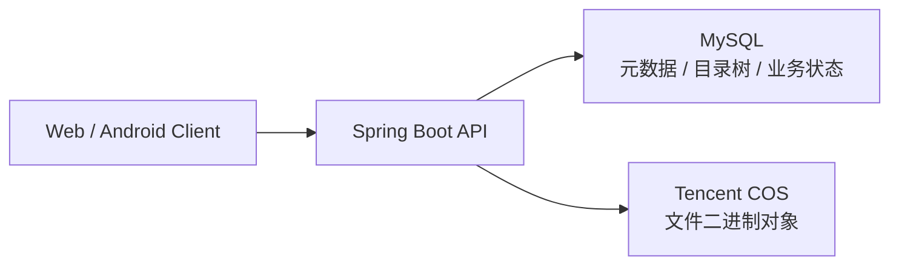

# 云盘后台服务设计方案

## 1. 设计目标

本项目的云盘后台采用一种很典型、也很适合业务系统长期维护的模式：

- 存储桶负责保存文件本体
- Server + SQL 负责做业务记录簿

用更直白的话说：

- 腾讯云 COS 只负责保存“文件内容”
- Spring Boot 服务负责“鉴权、校验、编排、权限控制、业务动作”
- MySQL 负责“记账、建目录、记状态、记关系、记回收站、记上传会话”

这意味着后台并不是把文件二进制直接塞进数据库，而是把数据库当作一套“文件业务账本”来使用。

---

## 2. 一句话架构

可以把它理解成：

- COS 是仓库，存真正的货
- SQL 是账本，记每件货属于谁、放在哪个目录、是否删除、能不能访问
- Server 是库管系统，所有动作都必须先经过它

---

## 3. 为什么采用这套模式

相比“数据库直接存文件 BLOB”，这套模式更适合云盘业务，原因主要有：

1. 大文件更适合放对象存储
2. 下载、预览、分片上传、续传更容易扩展
3. 数据库压力更小，备份和迁移成本更可控
4. 目录、权限、回收站、配额这类业务状态更适合结构化存储
5. 后续如果要加 CDN、预签名 URL、生命周期策略，也更自然

这个项目里，README 其实已经概括了这条主线：文件二进制内容在 COS，MySQL 存文件和文件夹元数据。

---

## 4. 职责拆分

## 4.1 存储桶负责什么

存储桶只负责保存对象本体，例如：

- 用户上传的普通文件
- 大文件分片上传后的最终对象
- 用户头像
- 用户主页背景图

对象存储里保存的是：

- 文件字节内容
- 对象键 `objectKey`
- 对象元信息，如 `contentType`

对象键由服务端生成，而不是直接相信前端传入的路径。

当前实现里，普通文件对象键按“用户 + 日期 + 随机文件名”生成，类似：

- `user-files/{userId}/{yyyy}/{MM}/{dd}/{uuid}{extension}`

这类键生成逻辑集中在 `CosFileStorageService` 中。

## 4.2 Server 负责什么

服务端是整个模式的真正中枢，负责：

- 登录鉴权和用户身份识别
- 校验用户是否有权访问某个文件
- 校验父目录是否合法
- 校验同目录重名
- 校验个人配额
- 决定是普通上传还是分片上传
- 决定返回下载流还是预签名 URL
- 决定回收站、恢复、彻底删除等业务动作
- 在 COS 与 SQL 之间做一致性兜底

也就是说，客户端永远不应该直接把“某个 COS 路径”当成事实来源，真正的事实来源是服务端加数据库里的记录。

## 4.3 SQL 负责什么

SQL 不存文件内容，但要存“文件这件事的全部业务身份信息”，包括：

- 这个文件属于谁
- 它在目录树中的父子关系
- 它显示出来叫什么名字
- 它是不是文件夹
- 它的大小、扩展名、MIME
- 它在 COS 中对应哪个对象键
- 它是否已经进入回收站
- 原始父目录是谁
- 删除时间和删除人是谁
- 分片上传会话进行到哪一步

所以 SQL 更像一本“云盘业务账本”，而不是文件仓库。

---

## 5. 核心数据模型

## 5.1 `storage_node`：文件系统账本主表

`storage_node` 是整个云盘最核心的业务表，它记录一个“节点”。

一个节点可能是：

- 文件夹
- 文件

关键字段可以按职责理解为：

- `owner_id`：归属用户
- `parent_id`：父目录
- `node_name`：显示名称
- `node_type`：`FOLDER` 或 `FILE`
- `file_size`：文件大小，文件夹通常为 `0`
- `file_extension` / `mime_type`：文件类型信息
- `storage_path`：对应 COS 对象键
- `is_deleted`：是否进入回收站
- `original_parent_id`：回收站恢复时的原父目录
- `deleted_at` / `deleted_by`：删除审计
- `parent_scope_id` + `active_node_name`：用于做“同目录下活动节点唯一名”约束

这张表的重要含义是：

- 文件夹本身只存在于 SQL，不需要在 COS 中建真实目录
- 文件在界面上显示的目录结构，本质上是 SQL 里的树关系
- COS 并不知道“目录树”，目录树完全由 SQL 维护

## 5.2 `multipart_upload_session`：分片上传会话账本

大文件上传不是一次请求完成，而是先建立一个上传会话，再逐片上传。

这张表主要记录：

- 谁发起的上传
- 目标父目录是谁
- 当前文件名、大小、分片大小、分片数量
- COS 侧的 `uploadId`
- 服务端生成的 `uploadToken`
- 对应的最终 `objectKey`
- 当前状态是否还在进行中

它的作用是让前端支持：

- 断点续传
- 刷新后继续上传
- 重试失败分片
- 取消上传

## 5.3 `multipart_upload_part`：已上传分片记录

这张表记录每个分片是否成功上传，包括：

- 属于哪个上传会话
- 第几片
- 这一片的大小
- COS 返回的 `ETag`

服务端在合并分片前，会用它来校验“分片是否齐全、顺序是否完整”。

## 5.4 用户与配额

身份表 `identity_user` 中维护：

- 角色
- 状态

云盘容量额度由 `cloud_user_profile.storage_quota_bytes` 维护。

而“已使用空间”并不是单独做一张余额表，而是基于文件节点聚合计算。

这说明 SQL 在这里承担的是“账本 + 规则”的角色，而不是简单缓存。

---

## 6. 核心业务流程

## 6.1 普通上传

普通上传链路可以概括为：

1. 客户端把文件发给服务端
2. 服务端校验登录态、父目录、重名、额度
3. 服务端生成对象键并把文件上传到 COS
4. COS 上传成功后，服务端再写入 `storage_node`
5. 如果 SQL 入库失败，服务端会反向删除刚上传的 COS 对象，避免留下孤儿文件

这个顺序非常关键：

- 先有对象
- 再有账本记录
- 如果记账失败，就把对象回滚掉

这样可以尽量降低“桶里有文件，但数据库里没登记”的脏数据概率。

## 6.2 文件下载 / 在线预览

下载或预览不是直接拼 COS 地址，而是：

1. 客户端请求某个文件 ID
2. 服务端先从 SQL 查节点并校验归属与状态
3. 确认这个节点是文件且未删除
4. 再根据 `storage_path` 去 COS 取流，或生成预签名 URL
5. 把安全可控的访问方式返回给客户端

这里的关键点是：

- 文件访问权限以 SQL 节点记录为准
- COS 只是最终取数位置
- 客户端不直接掌握永久可用的对象路径

## 6.3 重命名与移动

在当前设计里，重命名与移动主要改的是 SQL 元数据，而不是改 COS 对象键。

这有几个很实际的好处：

1. 改名和移动是轻量操作，不需要复制大文件
2. 不会因为改目录就触发对象存储里的重写
3. 目录树调整速度更快

换句话说：

- 用户看到的“目录位置”和“显示文件名”由 SQL 控制
- 真正的对象键更像内部存储定位符，不需要跟界面目录实时一致

这是“对象存储 + 业务账本”模式里非常常见的做法。

## 6.4 回收站

回收站不是立刻删 COS 文件，而是先改账本状态：

1. 将节点标记为 `is_deleted = 1`
2. 记录 `original_parent_id`
3. 记录 `deleted_at` 和 `deleted_by`
4. 子树节点一起进入回收站

这样做的好处是：

- 恢复成本低
- 不需要重新上传文件
- 目录结构和原始位置都还能追溯

## 6.5 恢复

恢复时，服务端会：

1. 尝试回到原父目录
2. 如果原父目录已经不存在，则回退到根目录
3. 清理回收站元数据
4. 再校验目标目录是否重名

所以恢复本质上也是 SQL 元数据修复过程。

## 6.6 彻底删除

彻底删除才真正清理 COS 对象：

1. 先收集子树中的所有文件节点
2. 找出它们对应的 `storage_path`
3. 逐个调用 COS 删除对象
4. 再删除 SQL 节点

因此回收站和彻底删除被拆成了两个层级：

- 软删除：改账本
- 硬删除：删对象 + 删账本

## 6.7 分片上传

大文件分片上传链路是：

1. 服务端初始化一个 COS multipart upload
2. 同时在 SQL 里创建上传会话记录
3. 客户端逐片上传
4. 服务端记录每片的 `ETag` 和大小
5. 全部分片齐全后通知 COS 合并
6. 合并成功后再生成正式 `storage_node`
7. 如果最终入库失败，再回滚已合并对象

这说明分片上传并不是“只靠 COS SDK 自己完成”，而是“COS 负责分片对象，SQL 负责会话账本”。

---

## 7. 这套模式的关键设计取舍

## 7.1 SQL 是真相源，COS 不是真相源

在业务层面，真正的文件身份是：

- 文件节点 ID
- 节点归属用户
- 目录位置
- 删除状态
- 文件显示名

不是某个裸露的对象键。

因此：

- 先查 SQL，再访问 COS
- 先通过服务端，再决定能否下载

## 7.2 文件夹是虚拟目录，不是对象存储目录

COS 并不需要真的创建文件夹对象。

文件夹只是 `storage_node` 中 `node_type = FOLDER` 的一种节点。  
这让目录操作可以完全保持业务侧灵活性。

## 7.3 对象键稳定，界面目录可变

对象键一旦生成，就尽量不要因为前端目录变化而反复变动。

这样可以避免：

- 大文件移动导致 COS 重写
- 改名触发复制
- 存储侧与业务侧强绑定

## 7.4 软删除优先，硬删除延后

先回收站、后彻底删除，是为了兼顾：

- 用户可恢复
- 降低误删风险
- 减少频繁 COS 删除/重建带来的成本

## 7.5 失败补偿必须存在

这类双存储系统最怕“半成功”：

- COS 成功，SQL 失败
- SQL 成功，COS 失败

当前项目已经在关键路径做了补偿：

- 普通上传入库失败时删 COS 对象
- 分片合并后入库失败时删最终对象
- 中断分片会话时清理未完成上传

这正是这类架构能落地的关键。

---

## 8. 优点

这套模式对当前云盘项目的优点很明确：

1. 支持海量文件时更容易横向扩展
2. 数据库更适合做搜索、筛选、排序、权限和回收站
3. 对大文件、预览、分片上传更友好
4. 目录和对象解耦，业务调整更轻
5. 更容易对接 CDN、临时访问 URL、生命周期清理策略

---

## 9. 当前模式的边界与注意点

虽然这套设计是合理的，但要意识到它天然是“双写系统”，因此有一些边界：

## 9.1 一致性依赖补偿逻辑

对象存储和数据库不是同一个事务资源。  
所以严格来说，这不是单库事务，而是“业务事务 + 补偿策略”。

## 9.2 已使用空间依赖元数据统计

配额统计基于 SQL 中文件节点的 `file_size` 聚合，而不是直接去 COS 扫桶。  
因此账本必须可靠，否则配额会失真。

## 9.3 孤儿对象仍要定期巡检

即使有失败补偿，也建议后续补一套离线巡检机制：

- 桶里有对象但 SQL 无记录
- SQL 有记录但桶里对象不存在

这样更适合长期运营。

## 9.4 搜索和树结构最终受 SQL 模型影响

当前目录树、回收站、批量移动、恢复逻辑都依赖 `storage_node` 这套邻接表结构。  
如果未来目录层级极深、数据量极大，可以继续考虑：

- 路径缓存
- 闭包表
- 物化路径
- 异步索引

---

## 10. 面向后续演进的建议

如果后面继续迭代，这套模式可以自然扩展到：

- 文件秒传 / 指纹去重
- 对象版本控制
- 生命周期清理策略
- 异步病毒扫描
- 操作审计日志
- 分享链接与临时授权
- 多存储桶 / 多区域策略
- 定时对账任务

这些能力都不需要推翻现有模式，只需要继续围绕“对象内容”和“业务账本”分层扩展。

---

## 11. 结论

本项目后台服务的核心设计可以概括为：

> 用对象存储保存文件本体，用 Server + SQL 维护文件的业务身份、目录关系、权限状态和生命周期。

这正是一个云盘系统比较稳妥、也比较工程化的实现方式。

可以把它记成一句口径：

> 存储桶存文件，SQL 记文件，Server 管文件。

或者更形象一点：

> COS 是仓库，SQL 是记录簿，Server 是调度台。

这份方案既符合当前仓库里的实现，也适合作为后续继续演进云盘后台的基础设计说明。
